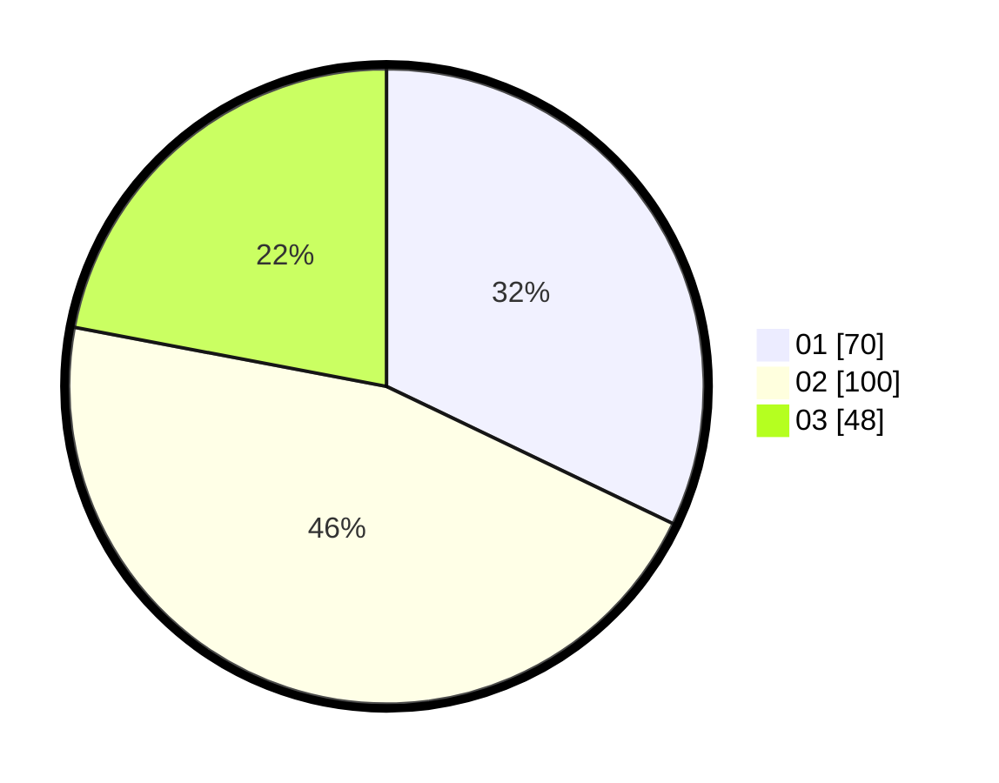

# Hasil

Hasil perolehan suara paslon dapat dilihat pada file paslon-01.txt, paslon-02.txt, dan paslon-03.txt.

Jika tidak ada, artinya data tersebut belum ada pada SIREKAP.

## Perolehan Suara

 * Paslon 01: **70**.
 * Paslon 02: **100**.
 * Paslon 03: **48**.

## Foto C Plano

https://sirekap-obj-formc.kpu.go.id/a284/pemilu/ppwp/31/73/02/10/01/3173021001017-20240214-202244--b6f3e5ad-7d26-45ec-ba89-b5f4ba1a90c3.jpg

https://sirekap-obj-formc.kpu.go.id/a284/pemilu/ppwp/31/73/02/10/01/3173021001017-20240214-202718--f45c8a2d-a235-4766-b3f3-ea17da24b40e.jpg

https://sirekap-obj-formc.kpu.go.id/a284/pemilu/ppwp/31/73/02/10/01/3173021001017-20240214-203031--04cd6c52-e988-4671-b2e1-7f48fa4f1aee.jpg

## DATA PEMILIH TETAP

Jumlah pemilih dalam DPT: **277**.
 * L: **134**.
 * P: **143**.

## DATA PENGGUNA HAK PILIH

Jumlah pengguna hak pilih dalam DPT: **206**.
 * L: **104**.
 * P: **102**.

Jumlah pengguna hak pilih dalam DPTb: **15**.
 * L: **8**.
 * P: **7**.

Jumlah pengguna hak pilih dalam DPK: **3**.
 * L: **1**.
 * P: **2**.

Jumlah pengguna hak pilih: **224**.
 * L: **113**.
 * P: **111**.

## JUMLAH SUARA SAH DAN TIDAK SAH

JUMLAH SELURUH SUARA SAH: **218**.

JUMLAH SUARA TIDAK SAH: **6**.

JUMLAH SELURUH SUARA SAH DAN SUARA TIDAK SAH: **224**.
