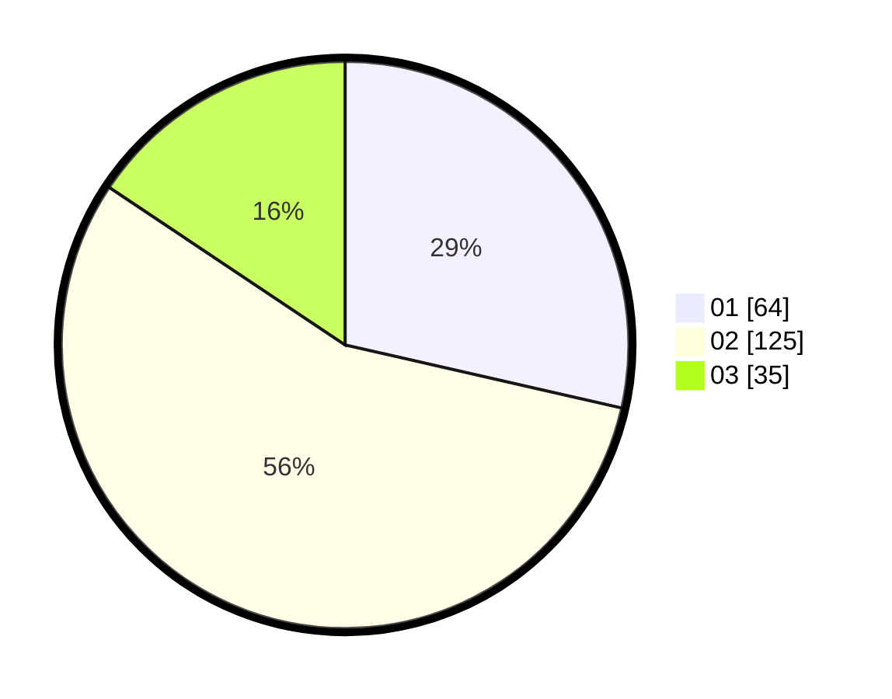

# Hasil

Hasil perolehan suara paslon dapat dilihat pada file paslon-01.txt, paslon-02.txt, dan paslon-03.txt.

Jika tidak ada, artinya data tersebut belum ada pada SIREKAP.

## Perolehan Suara

 * Paslon 01: **64**.
 * Paslon 02: **125**.
 * Paslon 03: **35**.

## Foto C Plano

https://sirekap-obj-formc.kpu.go.id/80c1/pemilu/ppwp/31/73/02/10/01/3173021001018-20240218-120111--27ce637d-4347-413a-820d-5323252a518c.jpg

https://sirekap-obj-formc.kpu.go.id/80c1/pemilu/ppwp/31/73/02/10/01/3173021001018-20240218-120138--dc136efd-9a60-4f8d-b828-c391cc6af140.jpg

https://sirekap-obj-formc.kpu.go.id/80c1/pemilu/ppwp/31/73/02/10/01/3173021001018-20240218-120224--5fbced0b-661e-411a-8f7e-c4078b88cefb.jpg

## DATA PEMILIH TETAP

Jumlah pemilih dalam DPT: **271**.
 * L: **143**.
 * P: **128**.

## DATA PENGGUNA HAK PILIH

Jumlah pengguna hak pilih dalam DPT: **201**.
 * L: **104**.
 * P: **97**.

Jumlah pengguna hak pilih dalam DPTb: **22**.
 * L: **6**.
 * P: **16**.

Jumlah pengguna hak pilih dalam DPK: **4**.
 * L: **2**.
 * P: **2**.

Jumlah pengguna hak pilih: **227**.
 * L: **112**.
 * P: **115**.

## JUMLAH SUARA SAH DAN TIDAK SAH

JUMLAH SELURUH SUARA SAH: **224**.

JUMLAH SUARA TIDAK SAH: **3**.

JUMLAH SELURUH SUARA SAH DAN SUARA TIDAK SAH: **227**.
