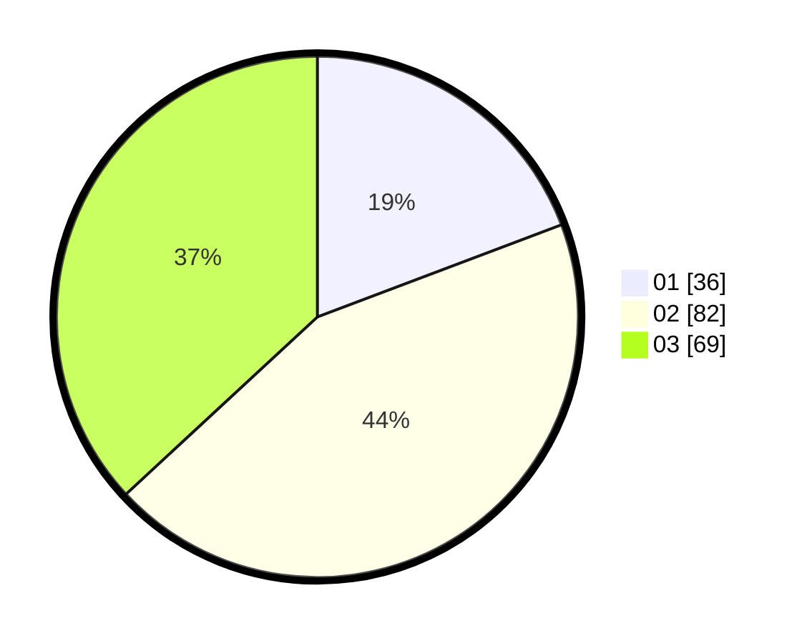

# Hasil

Hasil perolehan suara paslon dapat dilihat pada file paslon-01.txt, paslon-02.txt, dan paslon-03.txt.

Jika tidak ada, artinya data tersebut belum ada pada SIREKAP.

## Perolehan Suara

 * Paslon 01: **36**.
 * Paslon 02: **82**.
 * Paslon 03: **69**.

## Foto C Plano

https://sirekap-obj-formc.kpu.go.id/307a/pemilu/ppwp/31/73/02/10/01/3173021001027-20240219-113220--e6895167-c36e-48bc-9494-780a89f72c98.jpg

https://sirekap-obj-formc.kpu.go.id/307a/pemilu/ppwp/31/73/02/10/01/3173021001027-20240219-113221--61de832d-14d3-4e25-bd6a-c314fb8150dc.jpg

https://sirekap-obj-formc.kpu.go.id/307a/pemilu/ppwp/31/73/02/10/01/3173021001027-20240219-113220--d0b90af9-0cb0-4467-b87b-11e0eb0d2229.jpg

## DATA PEMILIH TETAP

Jumlah pemilih dalam DPT: **251**.
 * L: **129**.
 * P: **122**.

## DATA PENGGUNA HAK PILIH

Jumlah pengguna hak pilih dalam DPT: **168**.
 * L: **85**.
 * P: **83**.

Jumlah pengguna hak pilih dalam DPTb: **19**.
 * L: **6**.
 * P: **13**.

Jumlah pengguna hak pilih dalam DPK: **3**.
 * L: **0**.
 * P: **0**.

Jumlah pengguna hak pilih: **190**.
 * L: **0**.
 * P: **0**.

## JUMLAH SUARA SAH DAN TIDAK SAH

JUMLAH SELURUH SUARA SAH: **187**.

JUMLAH SUARA TIDAK SAH: **3**.

JUMLAH SELURUH SUARA SAH DAN SUARA TIDAK SAH: **190**.
