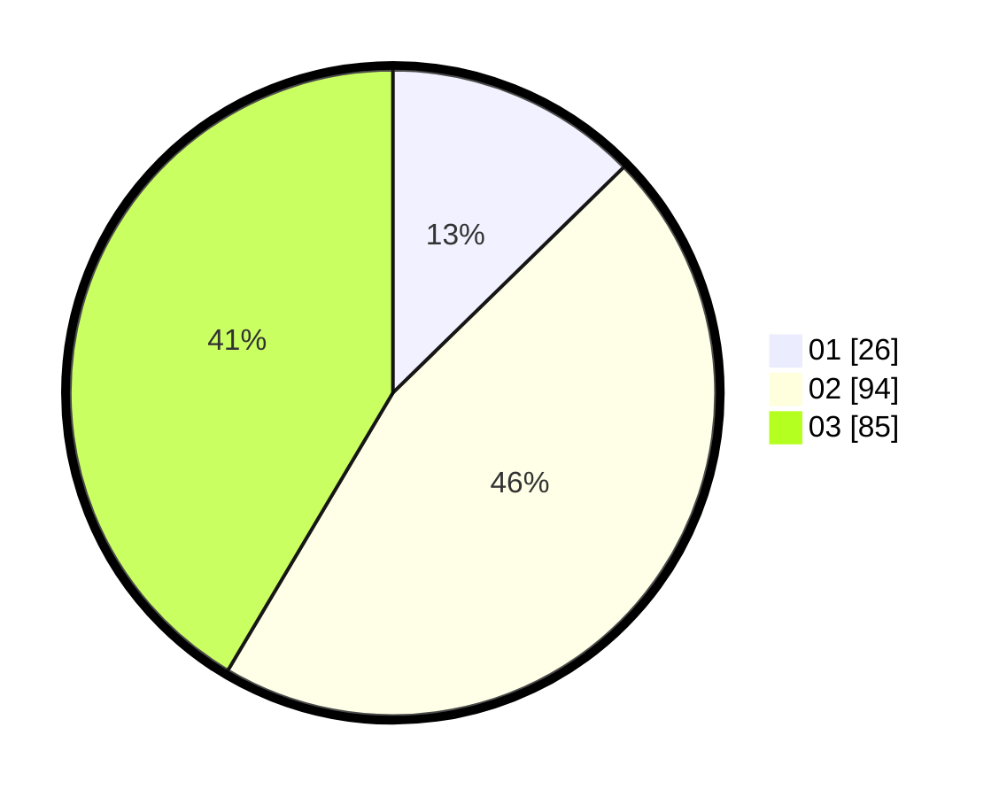

# Hasil

Hasil perolehan suara paslon dapat dilihat pada file paslon-01.txt, paslon-02.txt, dan paslon-03.txt.

Jika tidak ada, artinya data tersebut belum ada pada SIREKAP.

## Perolehan Suara

 * Paslon 01: **26**.
 * Paslon 02: **94**.
 * Paslon 03: **85**.

## Foto C Plano

https://sirekap-obj-formc.kpu.go.id/9dc4/pemilu/ppwp/31/73/02/10/01/3173021001030-20240214-185740--b3dd179e-f072-469b-9f2d-c38193226299.jpg

https://sirekap-obj-formc.kpu.go.id/9dc4/pemilu/ppwp/31/73/02/10/01/3173021001030-20240214-230844--0490faf1-8b70-4586-ba35-481d74d38ea9.jpg

https://sirekap-obj-formc.kpu.go.id/9dc4/pemilu/ppwp/31/73/02/10/01/3173021001030-20240214-185529--b73ec638-d5c5-4292-86d8-5d5210a457de.jpg

## DATA PEMILIH TETAP

Jumlah pemilih dalam DPT: **273**.
 * L: **130**.
 * P: **143**.

## DATA PENGGUNA HAK PILIH

Jumlah pengguna hak pilih dalam DPT: **181**.
 * L: **85**.
 * P: **96**.

Jumlah pengguna hak pilih dalam DPTb: **23**.
 * L: **10**.
 * P: **13**.

Jumlah pengguna hak pilih dalam DPK: **1**.
 * L: **1**.
 * P: **0**.

Jumlah pengguna hak pilih: **205**.
 * L: **96**.
 * P: **109**.

## JUMLAH SUARA SAH DAN TIDAK SAH

JUMLAH SELURUH SUARA SAH: **205**.

JUMLAH SUARA TIDAK SAH: **1**.

JUMLAH SELURUH SUARA SAH DAN SUARA TIDAK SAH: **206**.
