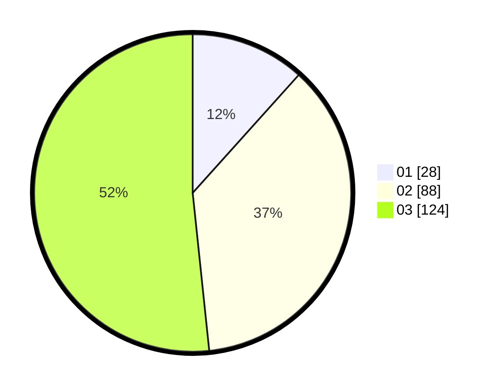

# Hasil

Hasil perolehan suara paslon dapat dilihat pada file paslon-01.txt, paslon-02.txt, dan paslon-03.txt.

Jika tidak ada, artinya data tersebut belum ada pada SIREKAP.

## Perolehan Suara

 * Paslon 01: **28**.
 * Paslon 02: **88**.
 * Paslon 03: **124**.

## Foto C Plano

https://sirekap-obj-formc.kpu.go.id/2935/pemilu/ppwp/31/73/02/10/01/3173021001036-20240215-050244--1b2e72f2-6fc3-4bf4-97fc-40acef43175a.jpg

https://sirekap-obj-formc.kpu.go.id/2935/pemilu/ppwp/31/73/02/10/01/3173021001036-20240215-050305--727f5372-c46a-4753-a48c-4a3da7176c61.jpg

https://sirekap-obj-formc.kpu.go.id/2935/pemilu/ppwp/31/73/02/10/01/3173021001036-20240215-050255--b78097d1-81d4-4990-b0e8-750c7c0e310f.jpg

## DATA PEMILIH TETAP

Jumlah pemilih dalam DPT: **279**.
 * L: **135**.
 * P: **144**.

## DATA PENGGUNA HAK PILIH

Jumlah pengguna hak pilih dalam DPT: **220**.
 * L: **105**.
 * P: **115**.

Jumlah pengguna hak pilih dalam DPTb: **18**.
 * L: **9**.
 * P: **9**.

Jumlah pengguna hak pilih dalam DPK: **3**.
 * L: **1**.
 * P: **2**.

Jumlah pengguna hak pilih: **241**.
 * L: **115**.
 * P: **126**.

## JUMLAH SUARA SAH DAN TIDAK SAH

JUMLAH SELURUH SUARA SAH: **240**.

JUMLAH SUARA TIDAK SAH: **1**.

JUMLAH SELURUH SUARA SAH DAN SUARA TIDAK SAH: **241**.
