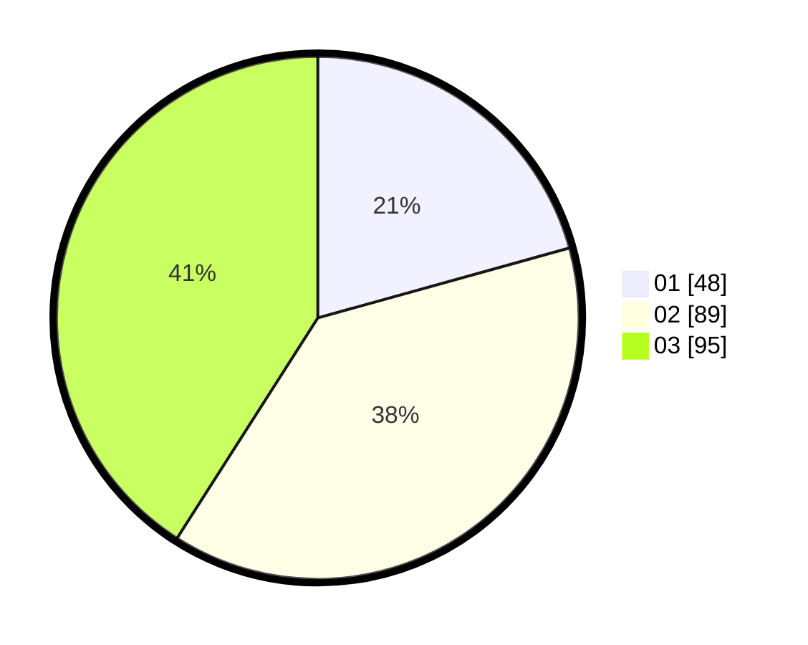

# Hasil

Hasil perolehan suara paslon dapat dilihat pada file paslon-01.txt, paslon-02.txt, dan paslon-03.txt.

Jika tidak ada, artinya data tersebut belum ada pada SIREKAP.

## Perolehan Suara

 * Paslon 01: **48**.
 * Paslon 02: **89**.
 * Paslon 03: **95**.

## Foto C Plano

https://sirekap-obj-formc.kpu.go.id/dcde/pemilu/ppwp/31/73/02/10/01/3173021001037-20240218-211037--80ceeee3-dac9-484f-88cd-2e1e7dcdb62a.jpg

https://sirekap-obj-formc.kpu.go.id/dcde/pemilu/ppwp/31/73/02/10/01/3173021001037-20240218-202949--6eda8644-5b1e-4231-aec0-f2c9e598466b.jpg

https://sirekap-obj-formc.kpu.go.id/dcde/pemilu/ppwp/31/73/02/10/01/3173021001037-20240218-203105--00c6681c-7e48-434d-af83-939dd8874b65.jpg
