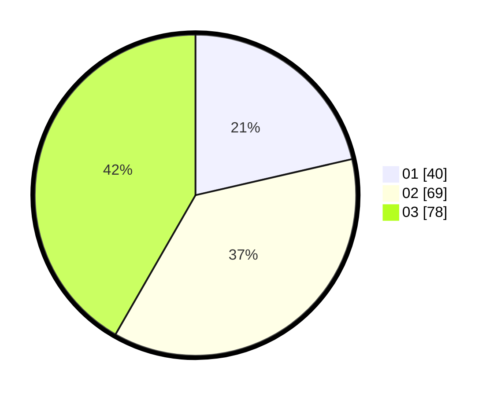

# Hasil

Hasil perolehan suara paslon dapat dilihat pada file paslon-01.txt, paslon-02.txt, dan paslon-03.txt.

Jika tidak ada, artinya data tersebut belum ada pada SIREKAP.

## Perolehan Suara

 * Paslon 01: **40**.
 * Paslon 02: **69**.
 * Paslon 03: **78**.

## Foto C Plano

https://sirekap-obj-formc.kpu.go.id/2de0/pemilu/ppwp/31/73/02/10/01/3173021001038-20240214-214124--8f6ef489-beeb-4f51-b928-ea624a8eb46d.jpg

https://sirekap-obj-formc.kpu.go.id/2de0/pemilu/ppwp/31/73/02/10/01/3173021001038-20240214-214318--d1bd0a32-82d1-4a32-bdc4-e0e0637ab3d4.jpg

https://sirekap-obj-formc.kpu.go.id/2de0/pemilu/ppwp/31/73/02/10/01/3173021001038-20240214-214513--a41bba29-fde1-4cc9-b58e-c704257e52f1.jpg

## DATA PEMILIH TETAP

Jumlah pemilih dalam DPT: **232**.
 * L: **111**.
 * P: **121**.

## DATA PENGGUNA HAK PILIH

Jumlah pengguna hak pilih dalam DPT: **168**.
 * L: **80**.
 * P: **88**.

Jumlah pengguna hak pilih dalam DPTb: **21**.
 * L: **6**.
 * P: **15**.

Jumlah pengguna hak pilih dalam DPK: **0**.
 * L: **0**.
 * P: **0**.

Jumlah pengguna hak pilih: **189**.
 * L: **86**.
 * P: **103**.

## JUMLAH SUARA SAH DAN TIDAK SAH

JUMLAH SELURUH SUARA SAH: **187**.

JUMLAH SUARA TIDAK SAH: **2**.

JUMLAH SELURUH SUARA SAH DAN SUARA TIDAK SAH: **189**.
