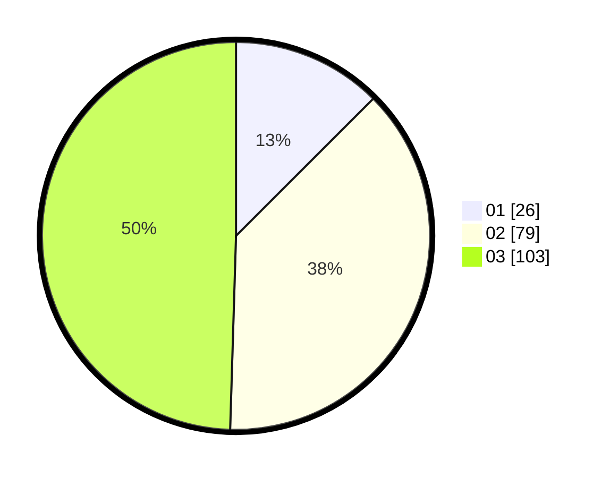

# Hasil

Hasil perolehan suara paslon dapat dilihat pada file paslon-01.txt, paslon-02.txt, dan paslon-03.txt.

Jika tidak ada, artinya data tersebut belum ada pada SIREKAP.

## Perolehan Suara

 * Paslon 01: **26**.
 * Paslon 02: **79**.
 * Paslon 03: **103**.

## Foto C Plano

https://sirekap-obj-formc.kpu.go.id/2f57/pemilu/ppwp/31/73/02/10/01/3173021001043-20240215-005135--9d59fb4c-0c6a-43aa-8fdd-b9fe5f744584.jpg

https://sirekap-obj-formc.kpu.go.id/2f57/pemilu/ppwp/31/73/02/10/01/3173021001043-20240215-005213--f0692ebd-ece2-4a85-b577-cc59c809d6a7.jpg

https://sirekap-obj-formc.kpu.go.id/2f57/pemilu/ppwp/31/73/02/10/01/3173021001043-20240215-005248--a401e95d-0e41-40be-a3f5-9911275d416c.jpg
