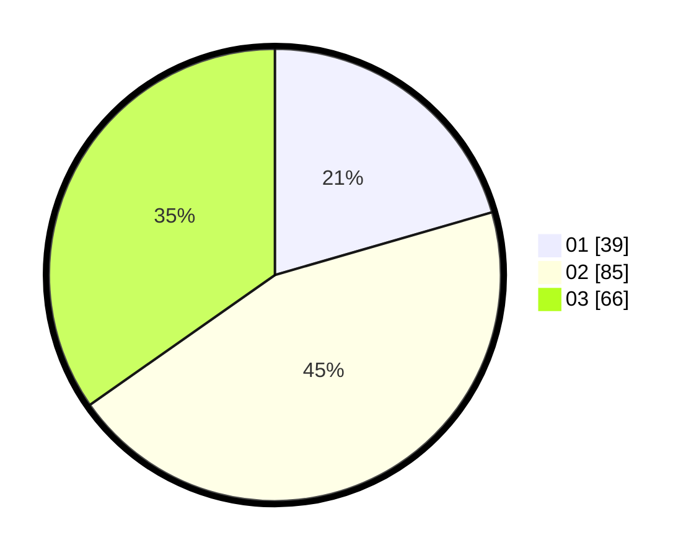

# Hasil

Hasil perolehan suara paslon dapat dilihat pada file paslon-01.txt, paslon-02.txt, dan paslon-03.txt.

Jika tidak ada, artinya data tersebut belum ada pada SIREKAP.

## Perolehan Suara

 * Paslon 01: **39**.
 * Paslon 02: **85**.
 * Paslon 03: **66**.

## Foto C Plano

https://sirekap-obj-formc.kpu.go.id/bf5c/pemilu/ppwp/31/73/02/10/01/3173021001046-20240214-162236--30f69680-0f10-48c0-b0b6-8135bdf5cdd0.jpg

https://sirekap-obj-formc.kpu.go.id/bf5c/pemilu/ppwp/31/73/02/10/01/3173021001046-20240214-162228--d015736f-997f-4713-a95d-4cb7c7f78ffe.jpg

https://sirekap-obj-formc.kpu.go.id/bf5c/pemilu/ppwp/31/73/02/10/01/3173021001046-20240214-190453--0e2e6212-c3f7-451d-bfbd-dc25787233c3.jpg

## DATA PEMILIH TETAP

Jumlah pemilih dalam DPT: **187**.
 * L: **90**.
 * P: **97**.

## DATA PENGGUNA HAK PILIH

Jumlah pengguna hak pilih dalam DPT: **187**.
 * L: **90**.
 * P: **97**.

Jumlah pengguna hak pilih dalam DPTb: **5**.
 * L: **2**.
 * P: **3**.

Jumlah pengguna hak pilih dalam DPK: **2**.
 * L: **1**.
 * P: **1**.

Jumlah pengguna hak pilih: **194**.
 * L: **93**.
 * P: **101**.

## JUMLAH SUARA SAH DAN TIDAK SAH

JUMLAH SELURUH SUARA SAH: **190**.

JUMLAH SUARA TIDAK SAH: **4**.

JUMLAH SELURUH SUARA SAH DAN SUARA TIDAK SAH: **194**.
