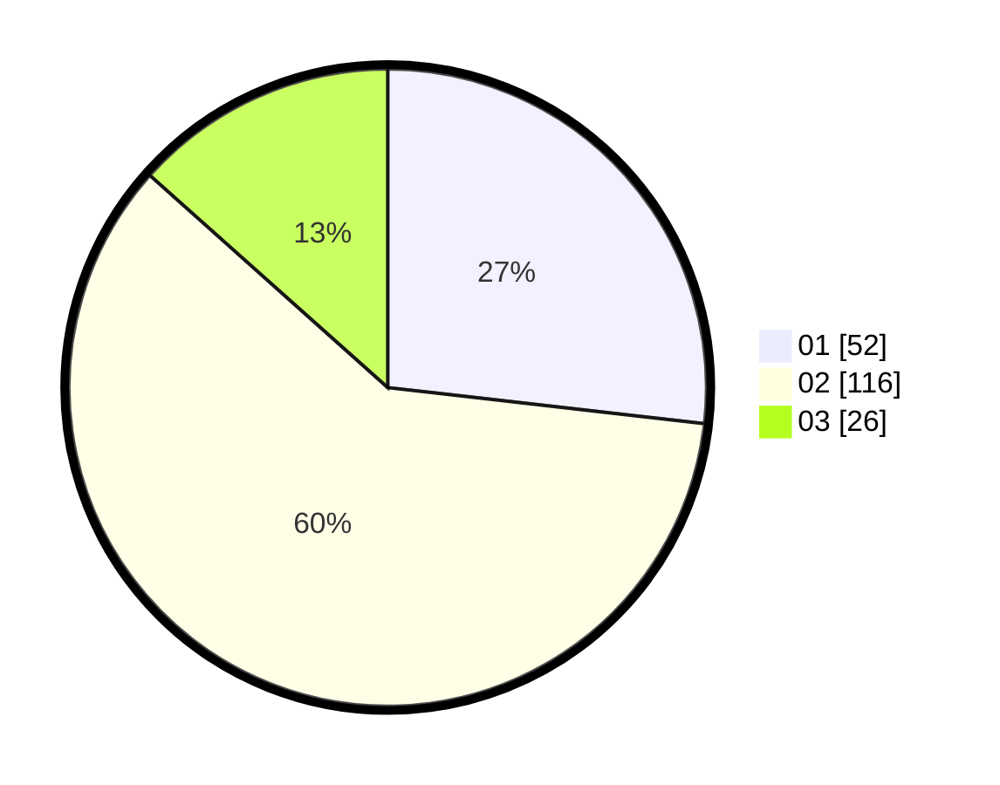

# Hasil

Hasil perolehan suara paslon dapat dilihat pada file paslon-01.txt, paslon-02.txt, dan paslon-03.txt.

Jika tidak ada, artinya data tersebut belum ada pada SIREKAP.

## Perolehan Suara

 * Paslon 01: **52**.
 * Paslon 02: **116**.
 * Paslon 03: **26**.

## Foto C Plano

https://sirekap-obj-formc.kpu.go.id/e9f0/pemilu/ppwp/31/73/02/10/01/3173021001051-20240217-105957--1b9204f2-519b-470f-beed-5cbe468c41e7.jpg

https://sirekap-obj-formc.kpu.go.id/e9f0/pemilu/ppwp/31/73/02/10/01/3173021001051-20240214-155052--d49d662c-909c-4015-a9d1-7d2b9eea6467.jpg

https://sirekap-obj-formc.kpu.go.id/e9f0/pemilu/ppwp/31/73/02/10/01/3173021001051-20240214-155445--23c18332-2d3a-415a-b2e6-5290952a0ce6.jpg

## DATA PEMILIH TETAP

Jumlah pemilih dalam DPT: **244**.
 * L: **125**.
 * P: **119**.

## DATA PENGGUNA HAK PILIH

Jumlah pengguna hak pilih dalam DPT: **186**.
 * L: **93**.
 * P: **93**.

Jumlah pengguna hak pilih dalam DPTb: **7**.
 * L: **3**.
 * P: **4**.

Jumlah pengguna hak pilih dalam DPK: **4**.
 * L: **1**.
 * P: **3**.

Jumlah pengguna hak pilih: **197**.
 * L: **97**.
 * P: **100**.

## JUMLAH SUARA SAH DAN TIDAK SAH

JUMLAH SELURUH SUARA SAH: **194**.

JUMLAH SUARA TIDAK SAH: **3**.

JUMLAH SELURUH SUARA SAH DAN SUARA TIDAK SAH: **197**.
