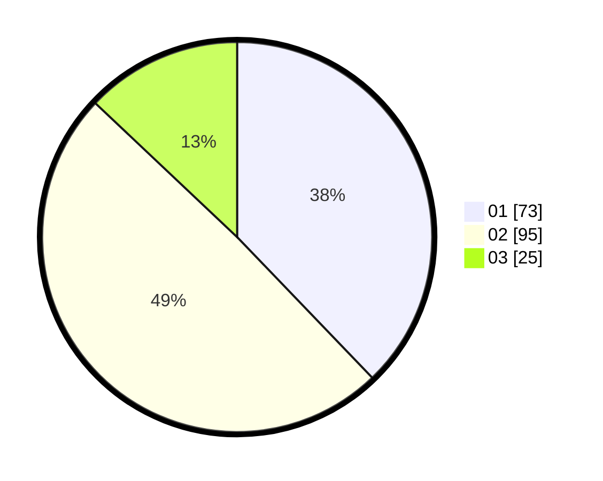

# Hasil

Hasil perolehan suara paslon dapat dilihat pada file paslon-01.txt, paslon-02.txt, dan paslon-03.txt.

Jika tidak ada, artinya data tersebut belum ada pada SIREKAP.

## Perolehan Suara

 * Paslon 01: **73**.
 * Paslon 02: **95**.
 * Paslon 03: **25**.

## Foto C Plano

https://sirekap-obj-formc.kpu.go.id/8ce4/pemilu/ppwp/31/73/02/10/01/3173021001054-20240216-091438--920d4960-fb0e-426d-a65a-f80d43404c8b.jpg

https://sirekap-obj-formc.kpu.go.id/8ce4/pemilu/ppwp/31/73/02/10/01/3173021001054-20240216-091152--4883fefa-c775-4402-98d9-47960d07d11d.jpg

https://sirekap-obj-formc.kpu.go.id/8ce4/pemilu/ppwp/31/73/02/10/01/3173021001054-20240216-091145--6f31bb81-c208-44d6-8168-0351511ddc42.jpg

## DATA PEMILIH TETAP

Jumlah pemilih dalam DPT: **251**.
 * L: **121**.
 * P: **130**.

## DATA PENGGUNA HAK PILIH

Jumlah pengguna hak pilih dalam DPT: **192**.
 * L: **93**.
 * P: **99**.

Jumlah pengguna hak pilih dalam DPTb: **2**.
 * L: **1**.
 * P: **1**.

Jumlah pengguna hak pilih dalam DPK: **2**.
 * L: **0**.
 * P: **2**.

Jumlah pengguna hak pilih: **196**.
 * L: **94**.
 * P: **102**.

## JUMLAH SUARA SAH DAN TIDAK SAH

JUMLAH SELURUH SUARA SAH: **193**.

JUMLAH SUARA TIDAK SAH: **3**.

JUMLAH SELURUH SUARA SAH DAN SUARA TIDAK SAH: **196**.
