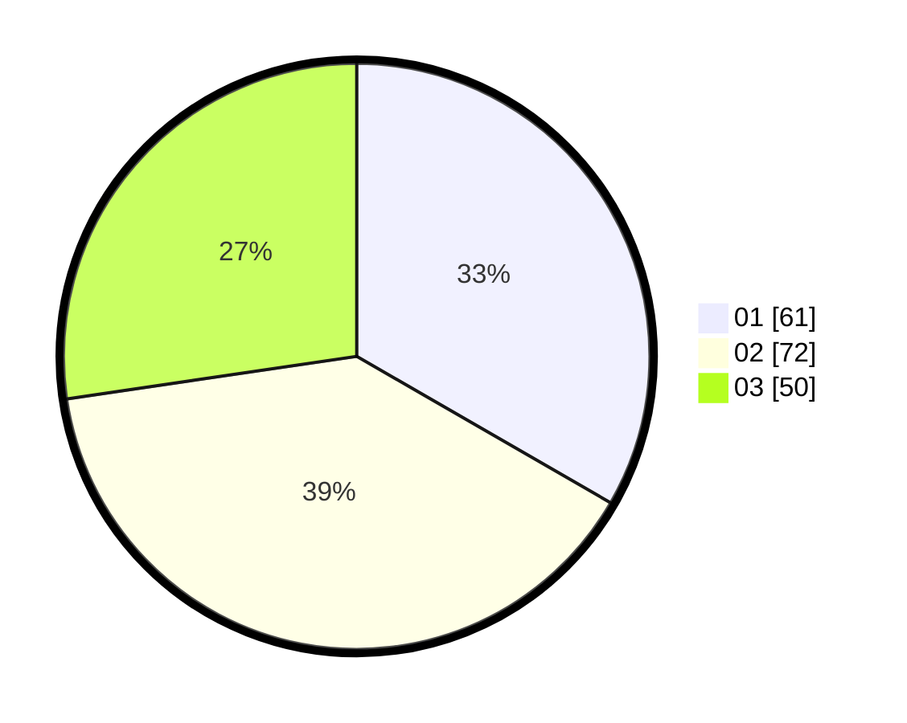

# Hasil

Hasil perolehan suara paslon dapat dilihat pada file paslon-01.txt, paslon-02.txt, dan paslon-03.txt.

Jika tidak ada, artinya data tersebut belum ada pada SIREKAP.

## Perolehan Suara

 * Paslon 01: **61**.
 * Paslon 02: **72**.
 * Paslon 03: **50**.

## Foto C Plano

https://sirekap-obj-formc.kpu.go.id/6ad0/pemilu/ppwp/31/73/02/10/01/3173021001057-20240214-230812--7906b1ac-3684-4df3-81e8-c2a9b8134fc5.jpg

https://sirekap-obj-formc.kpu.go.id/6ad0/pemilu/ppwp/31/73/02/10/01/3173021001057-20240214-230910--81fff01b-f29a-44a7-a035-eff8e8c60330.jpg

https://sirekap-obj-formc.kpu.go.id/6ad0/pemilu/ppwp/31/73/02/10/01/3173021001057-20240214-231018--01f12f58-27c0-4efa-b0c8-4a66bd3c1d78.jpg
