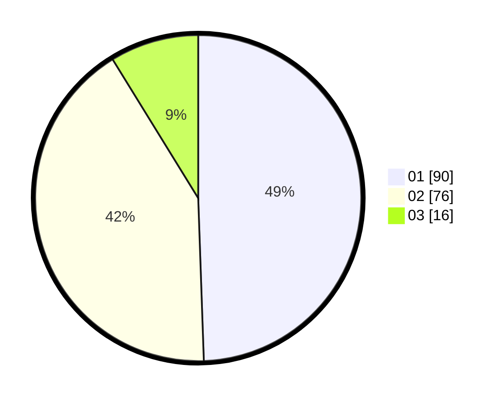

# Hasil

Hasil perolehan suara paslon dapat dilihat pada file paslon-01.txt, paslon-02.txt, dan paslon-03.txt.

Jika tidak ada, artinya data tersebut belum ada pada SIREKAP.

## Perolehan Suara

 * Paslon 01: **90**.
 * Paslon 02: **76**.
 * Paslon 03: **16**.

## Foto C Plano

https://sirekap-obj-formc.kpu.go.id/f6e0/pemilu/ppwp/31/73/02/10/01/3173021001060-20240214-200654--1ac9830a-c296-438c-bb9e-c41bd721d418.jpg

https://sirekap-obj-formc.kpu.go.id/f6e0/pemilu/ppwp/31/73/02/10/01/3173021001060-20240214-200711--4360dd42-76a9-4ff8-9d31-c23ddf14d753.jpg

https://sirekap-obj-formc.kpu.go.id/f6e0/pemilu/ppwp/31/73/02/10/01/3173021001060-20240214-200728--03b2f788-36d4-4340-808f-aa97f48aac6a.jpg
