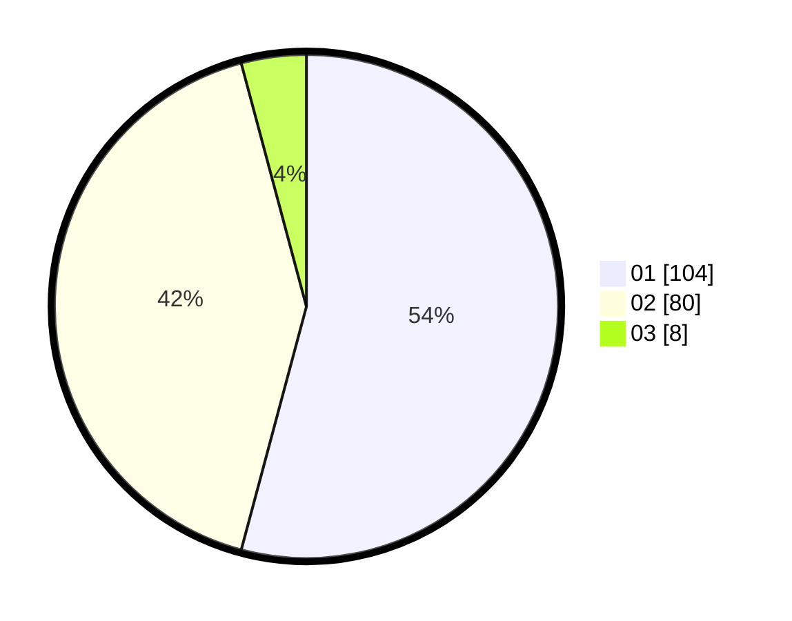

# Hasil

Hasil perolehan suara paslon dapat dilihat pada file paslon-01.txt, paslon-02.txt, dan paslon-03.txt.

Jika tidak ada, artinya data tersebut belum ada pada SIREKAP.

## Perolehan Suara

 * Paslon 01: **104**.
 * Paslon 02: **80**.
 * Paslon 03: **8**.

## Foto C Plano

https://sirekap-obj-formc.kpu.go.id/442d/pemilu/ppwp/31/73/02/10/01/3173021001061-20240214-204104--5eca4f1f-2010-43b2-8b55-1023a184df3f.jpg

https://sirekap-obj-formc.kpu.go.id/442d/pemilu/ppwp/31/73/02/10/01/3173021001061-20240214-204403--c0028da4-33c0-4720-8612-a272f08b56b7.jpg

https://sirekap-obj-formc.kpu.go.id/442d/pemilu/ppwp/31/73/02/10/01/3173021001061-20240214-204623--15f94ff1-62ac-4163-a069-1d52bb9586b6.jpg
