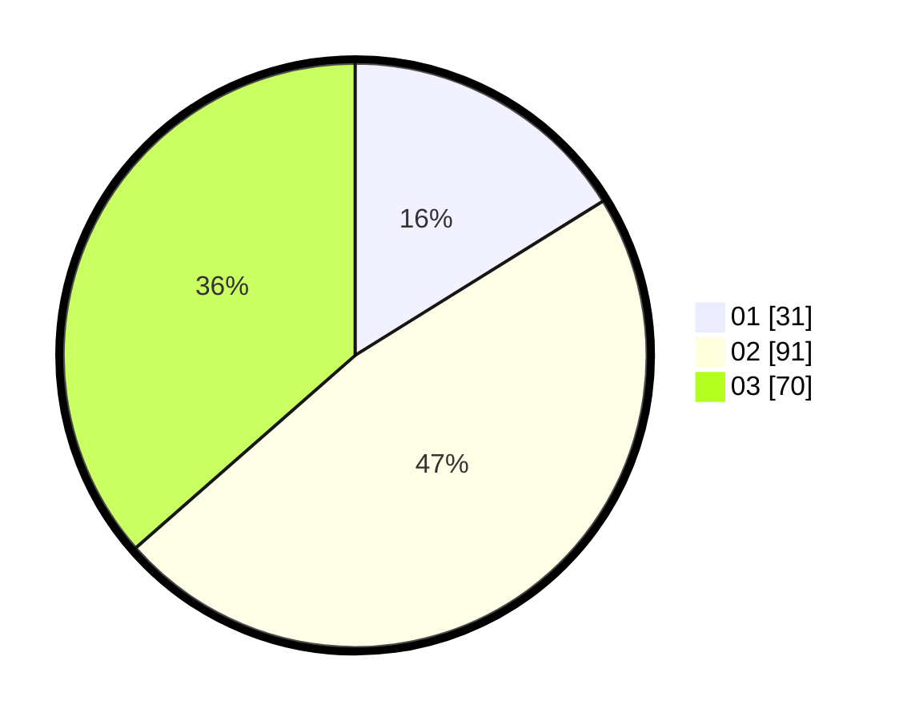

# Hasil

Hasil perolehan suara paslon dapat dilihat pada file paslon-01.txt, paslon-02.txt, dan paslon-03.txt.

Jika tidak ada, artinya data tersebut belum ada pada SIREKAP.

## Perolehan Suara

 * Paslon 01: **31**.
 * Paslon 02: **91**.
 * Paslon 03: **70**.

## Foto C Plano

https://sirekap-obj-formc.kpu.go.id/0a72/pemilu/ppwp/31/73/02/10/02/3173021002002-20240214-225427--56c10920-2377-4e46-aeeb-3486cfe8268e.jpg

https://sirekap-obj-formc.kpu.go.id/0a72/pemilu/ppwp/31/73/02/10/02/3173021002002-20240218-224541--979abceb-d6dc-4c02-b1da-df2045c64cee.jpg
