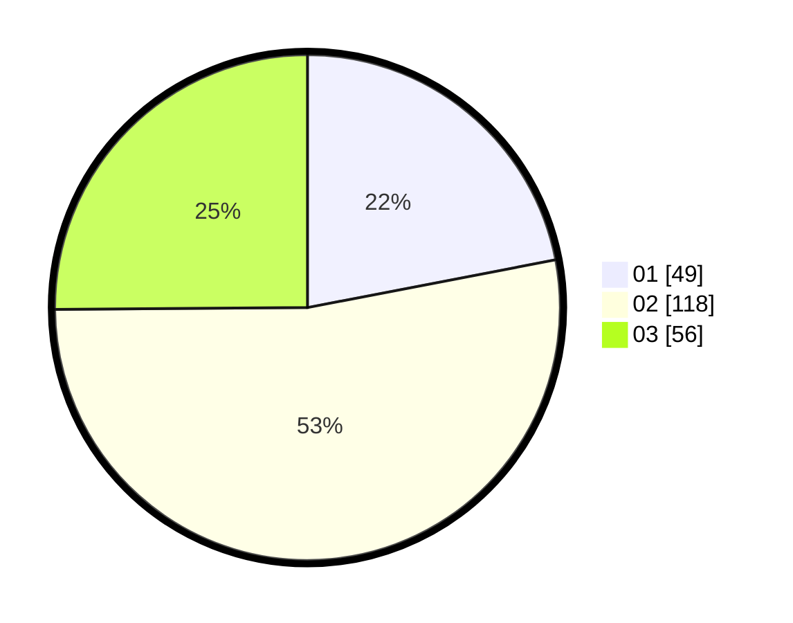

# Hasil

Hasil perolehan suara paslon dapat dilihat pada file paslon-01.txt, paslon-02.txt, dan paslon-03.txt.

Jika tidak ada, artinya data tersebut belum ada pada SIREKAP.

## Perolehan Suara

 * Paslon 01: **49**.
 * Paslon 02: **118**.
 * Paslon 03: **56**.

## Foto C Plano

https://sirekap-obj-formc.kpu.go.id/5bd0/pemilu/ppwp/31/73/02/10/02/3173021002003-20240214-205636--635c976d-63d3-4541-ae38-8febf25112c2.jpg

https://sirekap-obj-formc.kpu.go.id/5bd0/pemilu/ppwp/31/73/02/10/02/3173021002003-20240214-220919--41944476-8625-4de2-b7a8-55066c14c185.jpg

https://sirekap-obj-formc.kpu.go.id/5bd0/pemilu/ppwp/31/73/02/10/02/3173021002003-20240214-205717--5b5ae7fc-b70b-45c5-b1f8-9205e2e0d021.jpg
