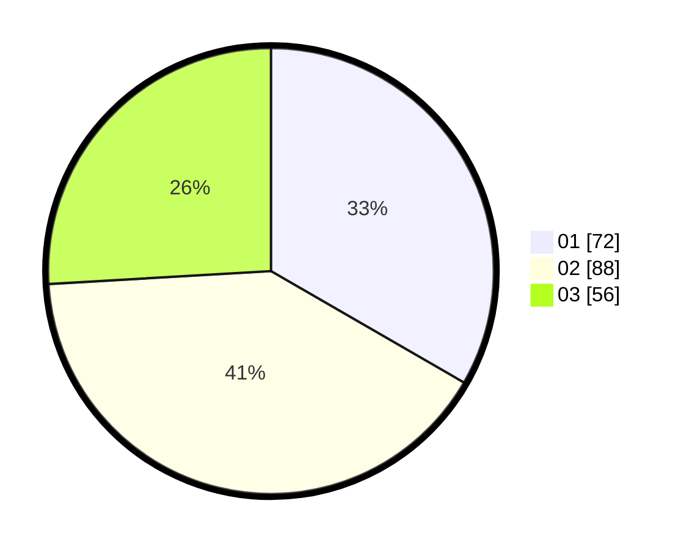

# Hasil

Hasil perolehan suara paslon dapat dilihat pada file paslon-01.txt, paslon-02.txt, dan paslon-03.txt.

Jika tidak ada, artinya data tersebut belum ada pada SIREKAP.

## Perolehan Suara

 * Paslon 01: **72**.
 * Paslon 02: **88**.
 * Paslon 03: **56**.

## Foto C Plano

https://sirekap-obj-formc.kpu.go.id/a8e1/pemilu/ppwp/31/73/02/10/02/3173021002004-20240215-000757--bcfec16d-e97b-467c-b493-01e55a0bafb7.jpg

https://sirekap-obj-formc.kpu.go.id/a8e1/pemilu/ppwp/31/73/02/10/02/3173021002004-20240215-002129--76895fd0-9d6d-4d0a-b0b4-6a07bae669ea.jpg

https://sirekap-obj-formc.kpu.go.id/a8e1/pemilu/ppwp/31/73/02/10/02/3173021002004-20240215-002108--8fb60095-fd0f-4f19-94a3-391a44062fac.jpg

## DATA PEMILIH TETAP

Jumlah pemilih dalam DPT: **254**.
 * L: **127**.
 * P: **127**.

## DATA PENGGUNA HAK PILIH

Jumlah pengguna hak pilih dalam DPT: **197**.
 * L: **95**.
 * P: **102**.

Jumlah pengguna hak pilih dalam DPTb: **16**.
 * L: **5**.
 * P: **11**.

Jumlah pengguna hak pilih dalam DPK: **4**.
 * L: **2**.
 * P: **2**.

Jumlah pengguna hak pilih: **217**.
 * L: **102**.
 * P: **115**.

## JUMLAH SUARA SAH DAN TIDAK SAH

JUMLAH SELURUH SUARA SAH: **216**.

JUMLAH SUARA TIDAK SAH: **1**.

JUMLAH SELURUH SUARA SAH DAN SUARA TIDAK SAH: **217**.
