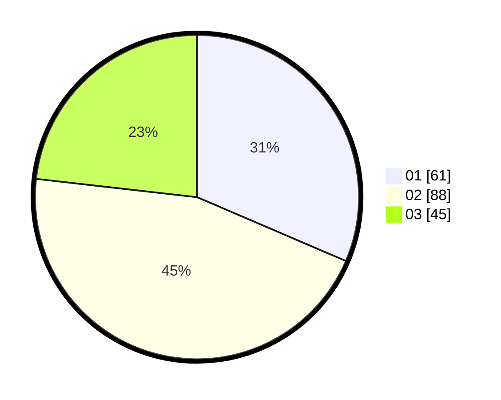

# Hasil

Hasil perolehan suara paslon dapat dilihat pada file paslon-01.txt, paslon-02.txt, dan paslon-03.txt.

Jika tidak ada, artinya data tersebut belum ada pada SIREKAP.

## Perolehan Suara

 * Paslon 01: **61**.
 * Paslon 02: **88**.
 * Paslon 03: **45**.

## Foto C Plano

https://sirekap-obj-formc.kpu.go.id/7957/pemilu/ppwp/31/73/02/10/02/3173021002005-20240215-081821--4fad1126-c60b-4959-ba93-f7026f15b480.jpg

https://sirekap-obj-formc.kpu.go.id/7957/pemilu/ppwp/31/73/02/10/02/3173021002005-20240215-082048--26c2e39d-8af6-4a9c-b00a-382c9412cdf6.jpg

https://sirekap-obj-formc.kpu.go.id/7957/pemilu/ppwp/31/73/02/10/02/3173021002005-20240215-082307--2f441aaa-cbdf-4906-9afd-2a6939744d9f.jpg
