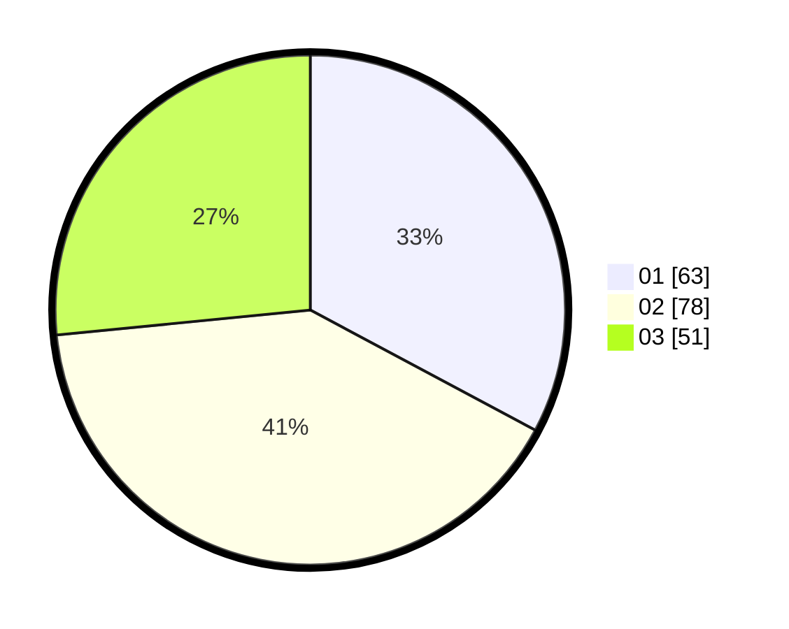

# Hasil

Hasil perolehan suara paslon dapat dilihat pada file paslon-01.txt, paslon-02.txt, dan paslon-03.txt.

Jika tidak ada, artinya data tersebut belum ada pada SIREKAP.

## Perolehan Suara

 * Paslon 01: **63**.
 * Paslon 02: **78**.
 * Paslon 03: **51**.

## Foto C Plano

https://sirekap-obj-formc.kpu.go.id/b0a9/pemilu/ppwp/31/73/02/10/02/3173021002011-20240214-231841--c6094458-6499-4a48-98c3-753a9dde2f27.jpg

https://sirekap-obj-formc.kpu.go.id/b0a9/pemilu/ppwp/31/73/02/10/02/3173021002011-20240214-231923--6c6e55ea-b889-4724-8a8e-283ce78fd4c0.jpg

https://sirekap-obj-formc.kpu.go.id/b0a9/pemilu/ppwp/31/73/02/10/02/3173021002011-20240214-232005--25ff51cf-1add-48f6-8823-c93663390524.jpg
