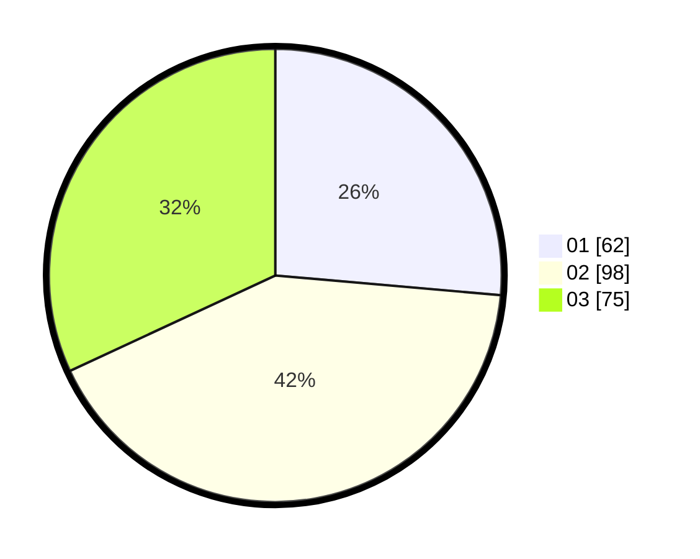

# Hasil

Hasil perolehan suara paslon dapat dilihat pada file paslon-01.txt, paslon-02.txt, dan paslon-03.txt.

Jika tidak ada, artinya data tersebut belum ada pada SIREKAP.

## Perolehan Suara

 * Paslon 01: **62**.
 * Paslon 02: **98**.
 * Paslon 03: **75**.

## Foto C Plano

https://sirekap-obj-formc.kpu.go.id/0b0b/pemilu/ppwp/31/73/02/10/02/3173021002012-20240214-215216--eb50ca5c-f890-4ce7-8ea9-9aec20151899.jpg

https://sirekap-obj-formc.kpu.go.id/0b0b/pemilu/ppwp/31/73/02/10/02/3173021002012-20240214-203355--7b5f7827-14e1-4c4f-9026-8fa6e7c91b5e.jpg

https://sirekap-obj-formc.kpu.go.id/0b0b/pemilu/ppwp/31/73/02/10/02/3173021002012-20240214-203447--2fdf02c0-28b9-4a48-b270-483bbe11ad8c.jpg
