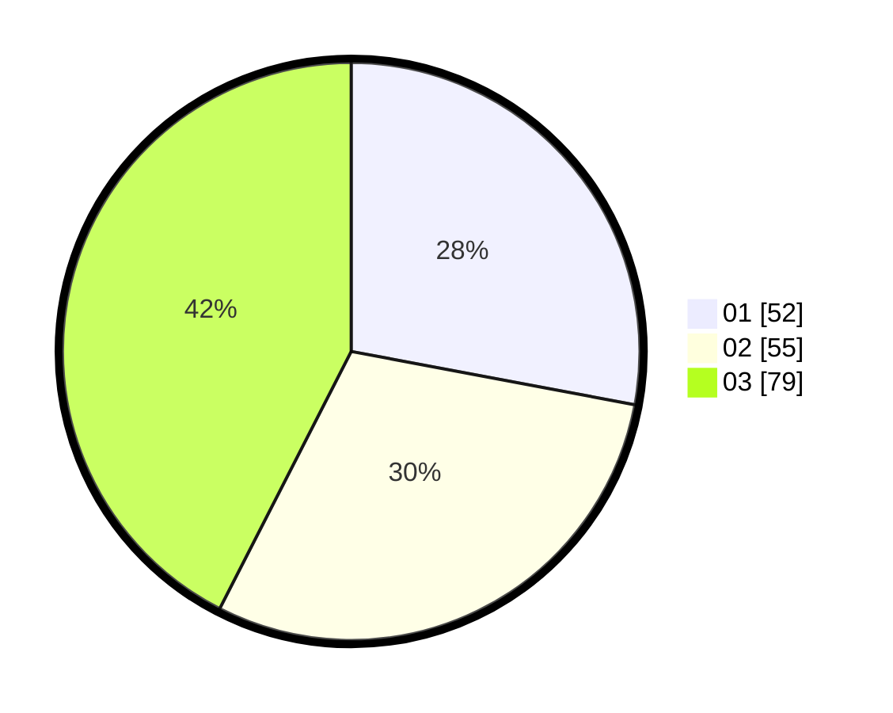

# Hasil

Hasil perolehan suara paslon dapat dilihat pada file paslon-01.txt, paslon-02.txt, dan paslon-03.txt.

Jika tidak ada, artinya data tersebut belum ada pada SIREKAP.

## Perolehan Suara

 * Paslon 01: **52**.
 * Paslon 02: **55**.
 * Paslon 03: **79**.

## Foto C Plano

https://sirekap-obj-formc.kpu.go.id/3879/pemilu/ppwp/31/73/02/10/02/3173021002016-20240214-204818--8394890a-4e75-469b-983f-4d3e3bf337b7.jpg

https://sirekap-obj-formc.kpu.go.id/3879/pemilu/ppwp/31/73/02/10/02/3173021002016-20240214-205020--4bbf1940-5630-48d0-bbcb-ab20336a9a2e.jpg

https://sirekap-obj-formc.kpu.go.id/3879/pemilu/ppwp/31/73/02/10/02/3173021002016-20240214-205212--6b36c19d-dfdf-480c-a2ce-c3bef1020a9b.jpg
