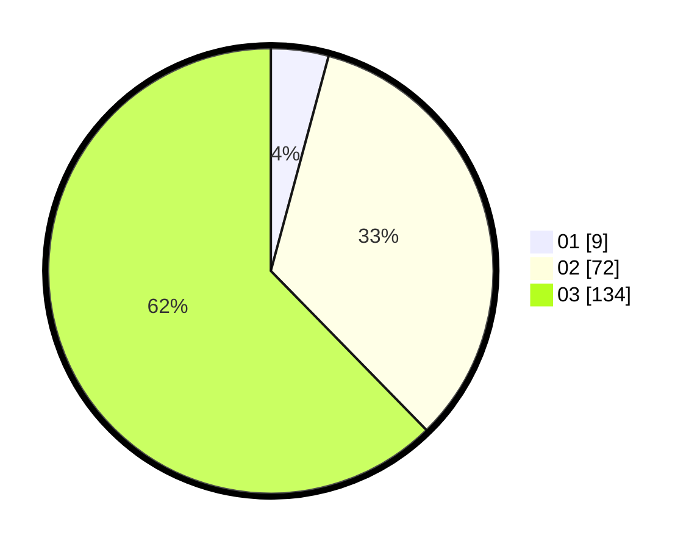

# Hasil

Hasil perolehan suara paslon dapat dilihat pada file paslon-01.txt, paslon-02.txt, dan paslon-03.txt.

Jika tidak ada, artinya data tersebut belum ada pada SIREKAP.

## Perolehan Suara

 * Paslon 01: **9**.
 * Paslon 02: **72**.
 * Paslon 03: **134**.

## Foto C Plano

https://sirekap-obj-formc.kpu.go.id/7a11/pemilu/ppwp/31/73/02/10/02/3173021002024-20240214-232643--a7ae0c86-e90f-4883-9258-0c4c1484c4cf.jpg

https://sirekap-obj-formc.kpu.go.id/7a11/pemilu/ppwp/31/73/02/10/02/3173021002024-20240214-232543--11d3bf16-321e-4113-9e5b-f4049db4a249.jpg
