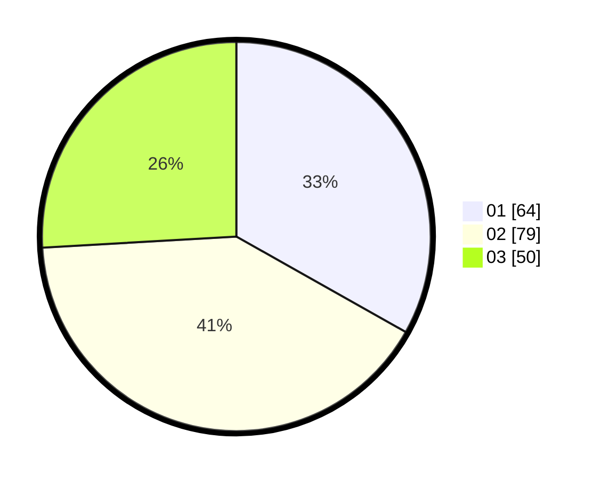

# Hasil

Hasil perolehan suara paslon dapat dilihat pada file paslon-01.txt, paslon-02.txt, dan paslon-03.txt.

Jika tidak ada, artinya data tersebut belum ada pada SIREKAP.

## Perolehan Suara

 * Paslon 01: **64**.
 * Paslon 02: **79**.
 * Paslon 03: **50**.

## Foto C Plano

https://sirekap-obj-formc.kpu.go.id/77b8/pemilu/ppwp/31/73/02/10/02/3173021002033-20240214-155525--27217be3-1e05-4f88-b670-11cbeed41009.jpg

https://sirekap-obj-formc.kpu.go.id/77b8/pemilu/ppwp/31/73/02/10/02/3173021002033-20240214-155927--346d8260-ad49-491b-9343-a2b5b4de1e23.jpg

https://sirekap-obj-formc.kpu.go.id/77b8/pemilu/ppwp/31/73/02/10/02/3173021002033-20240214-160101--b0a6ab56-0b6e-4114-a106-9af34f6746d1.jpg

## DATA PEMILIH TETAP

Jumlah pemilih dalam DPT: **270**.
 * L: **129**.
 * P: **141**.

## DATA PENGGUNA HAK PILIH

Jumlah pengguna hak pilih dalam DPT: **196**.
 * L: **90**.
 * P: **106**.

Jumlah pengguna hak pilih dalam DPTb: **3**.
 * L: **0**.
 * P: **3**.

Jumlah pengguna hak pilih dalam DPK: **0**.
 * L: **0**.
 * P: **0**.

Jumlah pengguna hak pilih: **199**.
 * L: **90**.
 * P: **109**.

## JUMLAH SUARA SAH DAN TIDAK SAH

JUMLAH SELURUH SUARA SAH: **193**.

JUMLAH SUARA TIDAK SAH: **6**.

JUMLAH SELURUH SUARA SAH DAN SUARA TIDAK SAH: **199**.
