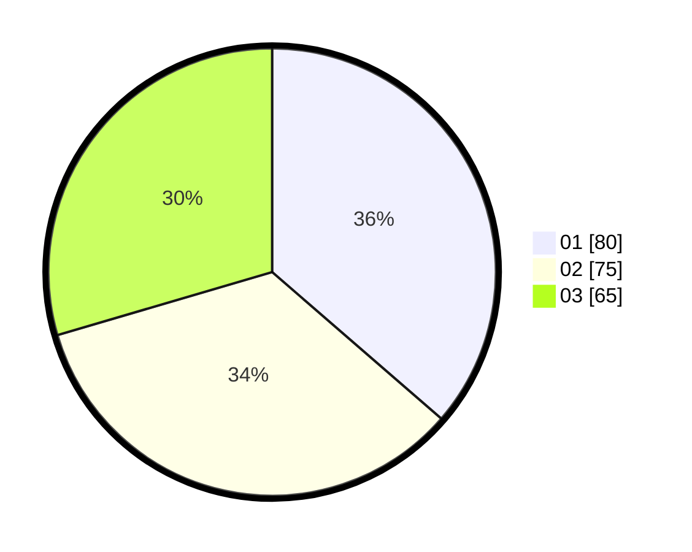

# Hasil

Hasil perolehan suara paslon dapat dilihat pada file paslon-01.txt, paslon-02.txt, dan paslon-03.txt.

Jika tidak ada, artinya data tersebut belum ada pada SIREKAP.

## Perolehan Suara

 * Paslon 01: **80**.
 * Paslon 02: **75**.
 * Paslon 03: **65**.

## Foto C Plano

https://sirekap-obj-formc.kpu.go.id/d128/pemilu/ppwp/31/73/02/10/02/3173021002038-20240215-220921--33f94547-5f77-4029-bc43-010f5116aa15.jpg

https://sirekap-obj-formc.kpu.go.id/d128/pemilu/ppwp/31/73/02/10/02/3173021002038-20240215-220922--3040215e-c6f9-411d-8879-ea67d68b0d54.jpg

https://sirekap-obj-formc.kpu.go.id/d128/pemilu/ppwp/31/73/02/10/02/3173021002038-20240215-220921--9737c205-32ab-4eec-aa15-16a64b7e44c1.jpg

## DATA PEMILIH TETAP

Jumlah pemilih dalam DPT: **275**.
 * L: **128**.
 * P: **147**.

## DATA PENGGUNA HAK PILIH

Jumlah pengguna hak pilih dalam DPT: **210**.
 * L: **94**.
 * P: **116**.

Jumlah pengguna hak pilih dalam DPTb: **4**.
 * L: **2**.
 * P: **2**.

Jumlah pengguna hak pilih dalam DPK: **6**.
 * L: **1**.
 * P: **5**.

Jumlah pengguna hak pilih: **220**.
 * L: **97**.
 * P: **123**.

## JUMLAH SUARA SAH DAN TIDAK SAH

JUMLAH SELURUH SUARA SAH: **220**.

JUMLAH SUARA TIDAK SAH: **0**.

JUMLAH SELURUH SUARA SAH DAN SUARA TIDAK SAH: **220**.
