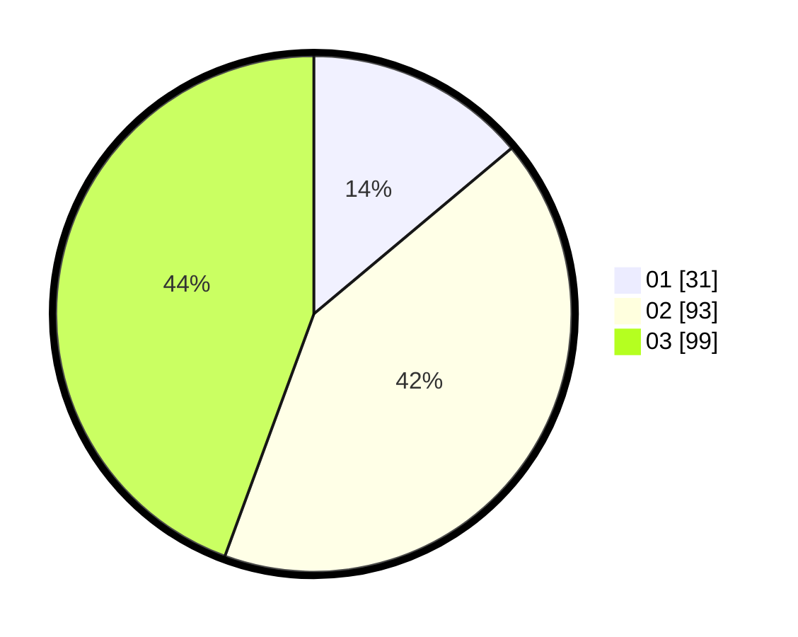

# Hasil

Hasil perolehan suara paslon dapat dilihat pada file paslon-01.txt, paslon-02.txt, dan paslon-03.txt.

Jika tidak ada, artinya data tersebut belum ada pada SIREKAP.

## Perolehan Suara

 * Paslon 01: **31**.
 * Paslon 02: **93**.
 * Paslon 03: **99**.

## Foto C Plano

https://sirekap-obj-formc.kpu.go.id/3eda/pemilu/ppwp/31/73/02/10/02/3173021002042-20240215-000146--1982057f-3006-4ab2-aab6-d852650e1e69.jpg

https://sirekap-obj-formc.kpu.go.id/3eda/pemilu/ppwp/31/73/02/10/02/3173021002042-20240215-000242--f1971aa8-dac1-491d-9027-72db608af3e0.jpg

https://sirekap-obj-formc.kpu.go.id/3eda/pemilu/ppwp/31/73/02/10/02/3173021002042-20240215-001248--17234a75-b214-4f0c-b498-7536504de19d.jpg
