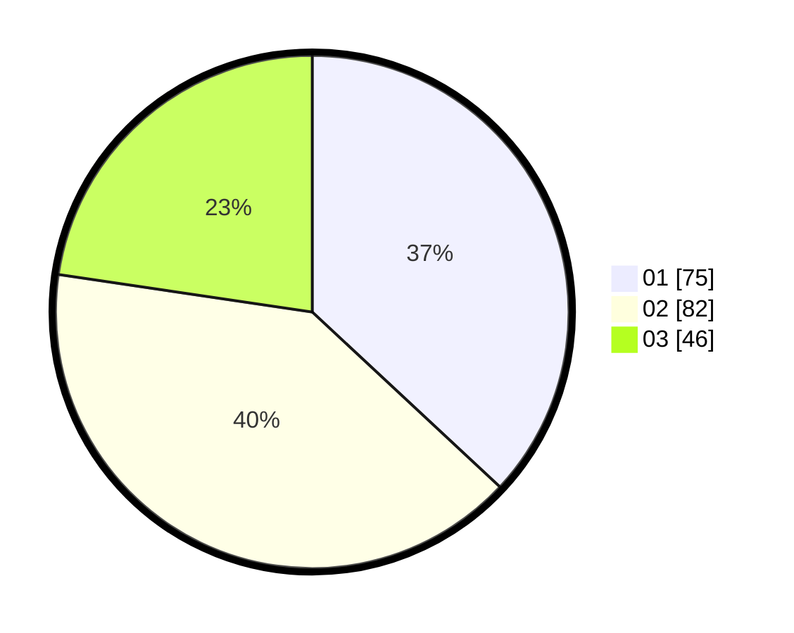

# Hasil

Hasil perolehan suara paslon dapat dilihat pada file paslon-01.txt, paslon-02.txt, dan paslon-03.txt.

Jika tidak ada, artinya data tersebut belum ada pada SIREKAP.

## Perolehan Suara

 * Paslon 01: **75**.
 * Paslon 02: **82**.
 * Paslon 03: **46**.

## Foto C Plano

https://sirekap-obj-formc.kpu.go.id/eca5/pemilu/ppwp/31/73/02/10/02/3173021002043-20240218-230547--98abdd70-d30c-4149-9c6e-dd7c6168c68c.jpg

https://sirekap-obj-formc.kpu.go.id/eca5/pemilu/ppwp/31/73/02/10/02/3173021002043-20240214-235911--715f6a89-05b2-4f63-a97d-c921664bbafb.jpg

https://sirekap-obj-formc.kpu.go.id/eca5/pemilu/ppwp/31/73/02/10/02/3173021002043-20240214-235951--3623e210-a5f7-400c-8604-fe246eb223ce.jpg
