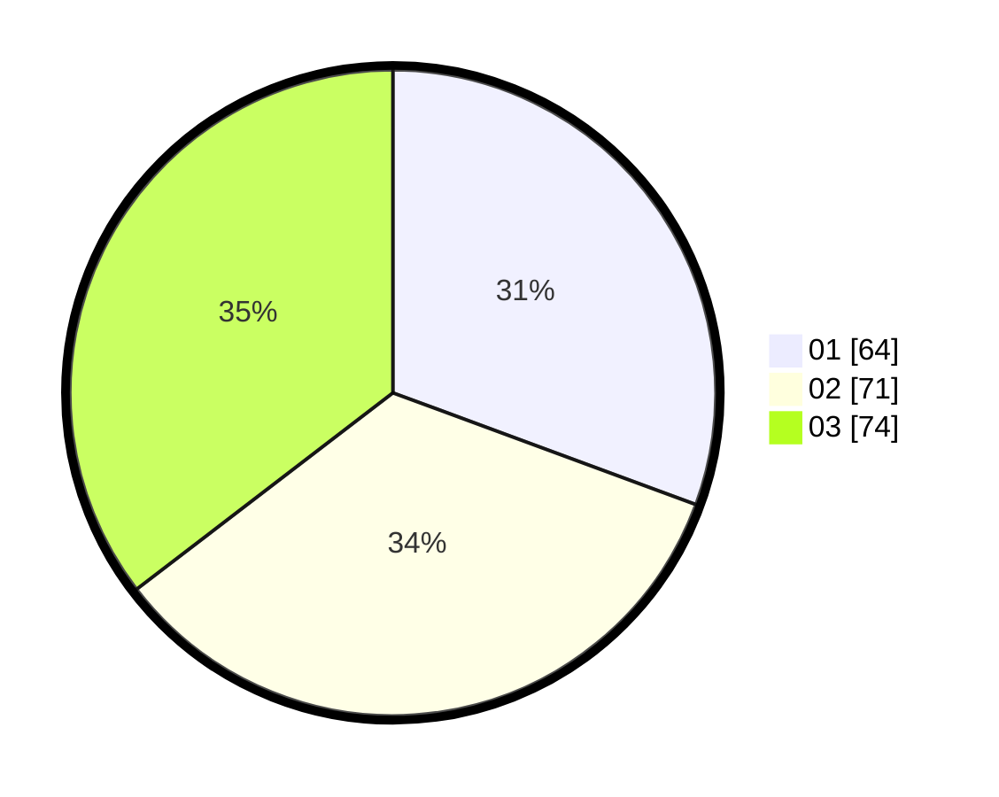

# Hasil

Hasil perolehan suara paslon dapat dilihat pada file paslon-01.txt, paslon-02.txt, dan paslon-03.txt.

Jika tidak ada, artinya data tersebut belum ada pada SIREKAP.

## Perolehan Suara

 * Paslon 01: **64**.
 * Paslon 02: **71**.
 * Paslon 03: **74**.

## Foto C Plano

https://sirekap-obj-formc.kpu.go.id/e7aa/pemilu/ppwp/31/73/02/10/02/3173021002044-20240214-215315--f365f01f-630b-48c7-80ba-01e8f132208e.jpg

https://sirekap-obj-formc.kpu.go.id/e7aa/pemilu/ppwp/31/73/02/10/02/3173021002044-20240214-213746--f1e371ca-c3b3-4caa-8392-31c9cb90ee36.jpg

https://sirekap-obj-formc.kpu.go.id/e7aa/pemilu/ppwp/31/73/02/10/02/3173021002044-20240214-215338--7bbbcdc5-24ce-44c6-a1d8-b17a05d1f980.jpg
