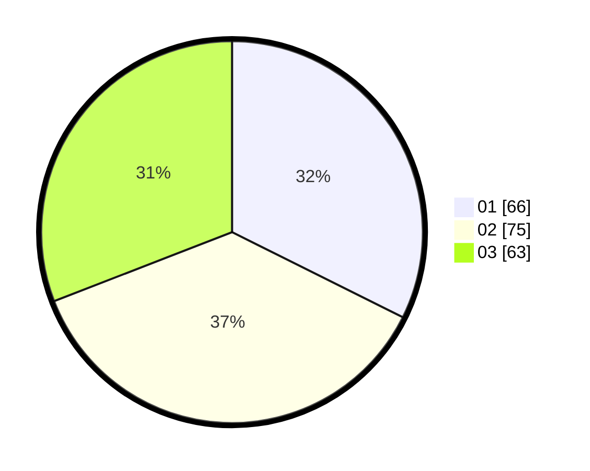

# Hasil

Hasil perolehan suara paslon dapat dilihat pada file paslon-01.txt, paslon-02.txt, dan paslon-03.txt.

Jika tidak ada, artinya data tersebut belum ada pada SIREKAP.

## Perolehan Suara

 * Paslon 01: **66**.
 * Paslon 02: **75**.
 * Paslon 03: **63**.

## Foto C Plano

https://sirekap-obj-formc.kpu.go.id/41cf/pemilu/ppwp/31/73/02/10/02/3173021002048-20240214-232435--90407ea4-5c27-42c6-8e97-1d2362ed408b.jpg

https://sirekap-obj-formc.kpu.go.id/41cf/pemilu/ppwp/31/73/02/10/02/3173021002048-20240214-232522--978b7bf9-1d40-473c-91ec-a38f309c36ce.jpg

https://sirekap-obj-formc.kpu.go.id/41cf/pemilu/ppwp/31/73/02/10/02/3173021002048-20240214-232608--990ff990-182e-4558-93c9-7b6f561ee0e1.jpg
