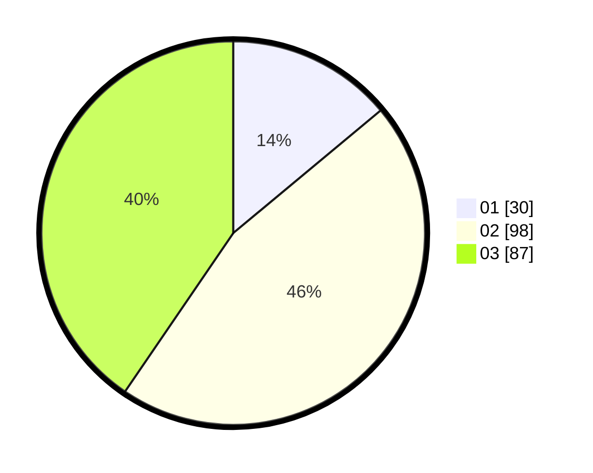

# Hasil

Hasil perolehan suara paslon dapat dilihat pada file paslon-01.txt, paslon-02.txt, dan paslon-03.txt.

Jika tidak ada, artinya data tersebut belum ada pada SIREKAP.

## Perolehan Suara

 * Paslon 01: **30**.
 * Paslon 02: **98**.
 * Paslon 03: **87**.

## Foto C Plano

https://sirekap-obj-formc.kpu.go.id/ea6b/pemilu/ppwp/31/73/02/10/02/3173021002049-20240215-003423--1eabf16b-174b-4407-b45c-346f8886d92c.jpg

https://sirekap-obj-formc.kpu.go.id/ea6b/pemilu/ppwp/31/73/02/10/02/3173021002049-20240215-003314--fd009ab9-b9b0-42c9-8aac-5a97de97680b.jpg

https://sirekap-obj-formc.kpu.go.id/ea6b/pemilu/ppwp/31/73/02/10/02/3173021002049-20240215-003201--3446ae1a-22a4-4f6e-a3c9-ee901190e06c.jpg
