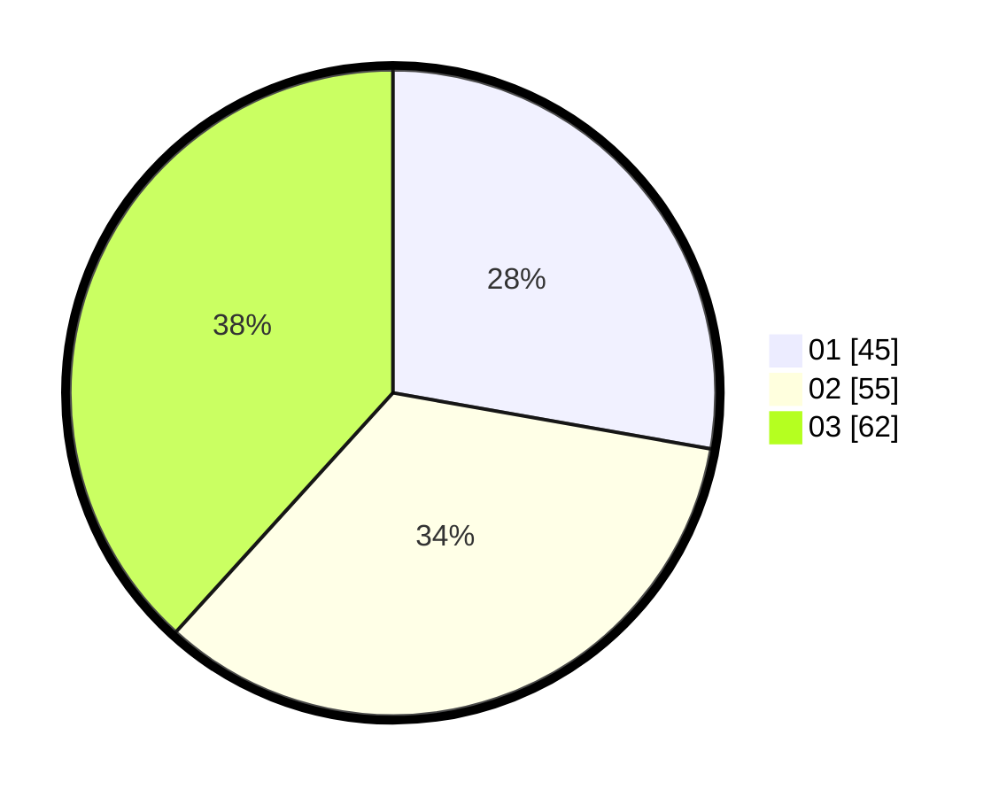

# Hasil

Hasil perolehan suara paslon dapat dilihat pada file paslon-01.txt, paslon-02.txt, dan paslon-03.txt.

Jika tidak ada, artinya data tersebut belum ada pada SIREKAP.

## Perolehan Suara

 * Paslon 01: **45**.
 * Paslon 02: **55**.
 * Paslon 03: **62**.

## Foto C Plano

https://sirekap-obj-formc.kpu.go.id/2b9a/pemilu/ppwp/31/73/02/10/02/3173021002053-20240214-160110--49cd23c6-aac0-47a3-865a-c1f8b94e5741.jpg

https://sirekap-obj-formc.kpu.go.id/2b9a/pemilu/ppwp/31/73/02/10/02/3173021002053-20240216-051210--e410d530-1ba4-4faf-bef9-4506274a069a.jpg

https://sirekap-obj-formc.kpu.go.id/2b9a/pemilu/ppwp/31/73/02/10/02/3173021002053-20240216-051430--947ae0c3-6c17-4298-b99f-342433e636fb.jpg

## DATA PEMILIH TETAP

Jumlah pemilih dalam DPT: **198**.
 * L: **90**.
 * P: **108**.

## DATA PENGGUNA HAK PILIH

Jumlah pengguna hak pilih dalam DPT: **160**.
 * L: **73**.
 * P: **87**.

Jumlah pengguna hak pilih dalam DPTb: **3**.
 * L: **0**.
 * P: **3**.

Jumlah pengguna hak pilih dalam DPK: **2**.
 * L: **1**.
 * P: **1**.

Jumlah pengguna hak pilih: **165**.
 * L: **74**.
 * P: **91**.

## JUMLAH SUARA SAH DAN TIDAK SAH

JUMLAH SELURUH SUARA SAH: **162**.

JUMLAH SUARA TIDAK SAH: **3**.

JUMLAH SELURUH SUARA SAH DAN SUARA TIDAK SAH: **165**.
