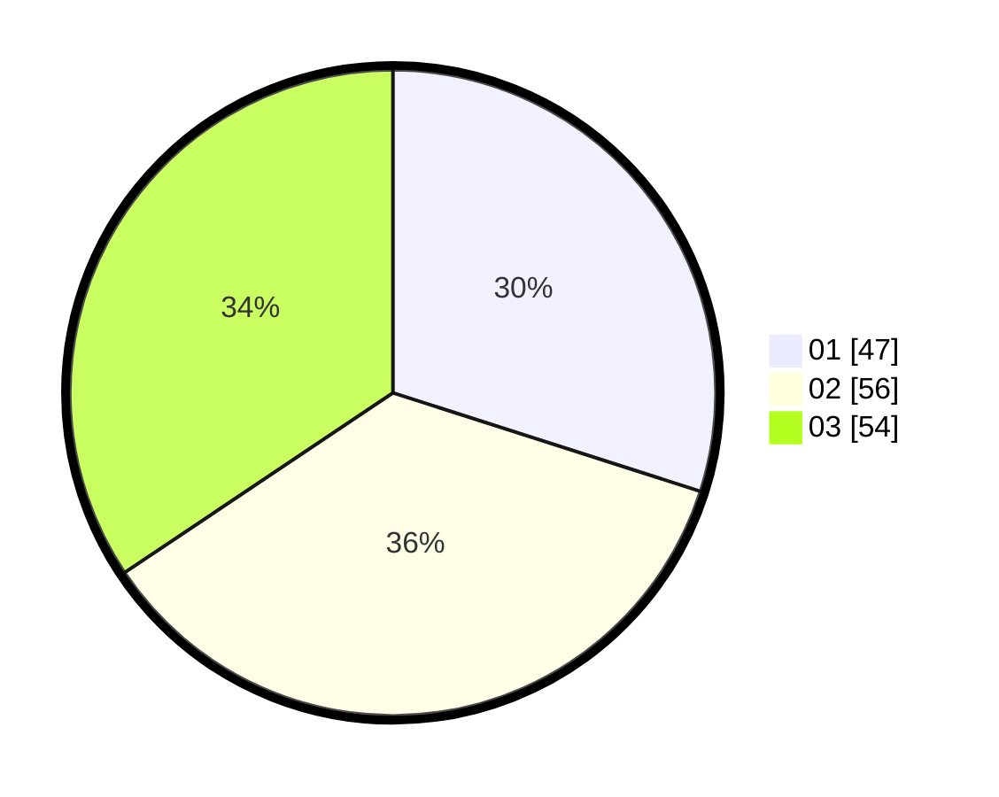

# Hasil

Hasil perolehan suara paslon dapat dilihat pada file paslon-01.txt, paslon-02.txt, dan paslon-03.txt.

Jika tidak ada, artinya data tersebut belum ada pada SIREKAP.

## Perolehan Suara

 * Paslon 01: **47**.
 * Paslon 02: **56**.
 * Paslon 03: **54**.

## Foto C Plano

https://sirekap-obj-formc.kpu.go.id/0e3b/pemilu/ppwp/31/73/02/10/02/3173021002054-20240214-232804--0f40b262-74dd-4a8b-8761-f8693d63b096.jpg

https://sirekap-obj-formc.kpu.go.id/0e3b/pemilu/ppwp/31/73/02/10/02/3173021002054-20240214-213315--127432f8-dbb9-4808-a471-2cb72432bd46.jpg

https://sirekap-obj-formc.kpu.go.id/0e3b/pemilu/ppwp/31/73/02/10/02/3173021002054-20240214-213404--de5875f7-8482-4df2-bdc8-ab8164f6300f.jpg
