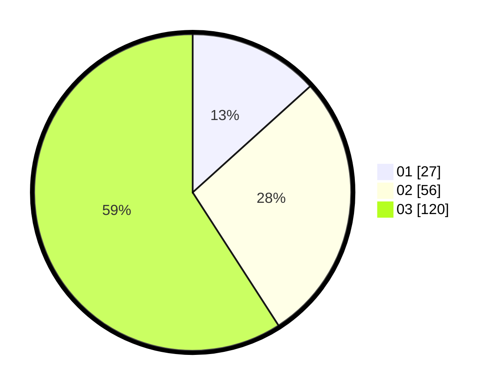

# Hasil

Hasil perolehan suara paslon dapat dilihat pada file paslon-01.txt, paslon-02.txt, dan paslon-03.txt.

Jika tidak ada, artinya data tersebut belum ada pada SIREKAP.

## Perolehan Suara

 * Paslon 01: **27**.
 * Paslon 02: **56**.
 * Paslon 03: **120**.

## Foto C Plano

https://sirekap-obj-formc.kpu.go.id/2421/pemilu/ppwp/31/73/02/10/02/3173021002057-20240214-190349--763c2e66-91bb-4eed-8c93-00b539ffe6e3.jpg

https://sirekap-obj-formc.kpu.go.id/2421/pemilu/ppwp/31/73/02/10/02/3173021002057-20240214-190453--f776b615-9763-4d6c-9bc4-e1956094b6d5.jpg

https://sirekap-obj-formc.kpu.go.id/2421/pemilu/ppwp/31/73/02/10/02/3173021002057-20240214-190300--74842262-9f4c-4c38-b7a9-ead15359dffe.jpg
