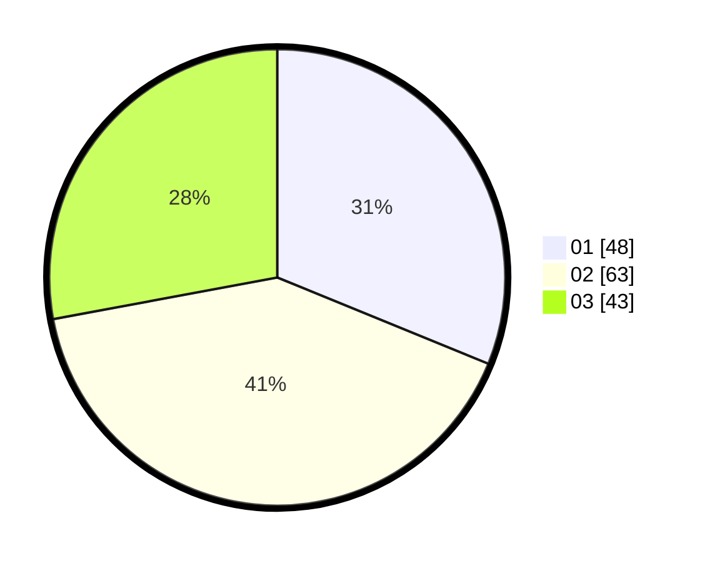

# Hasil

Hasil perolehan suara paslon dapat dilihat pada file paslon-01.txt, paslon-02.txt, dan paslon-03.txt.

Jika tidak ada, artinya data tersebut belum ada pada SIREKAP.

## Perolehan Suara

 * Paslon 01: **48**.
 * Paslon 02: **63**.
 * Paslon 03: **43**.

## Foto C Plano

https://sirekap-obj-formc.kpu.go.id/d872/pemilu/ppwp/31/73/02/10/02/3173021002059-20240214-192420--bc219495-e7b5-46fc-b88d-3edc3c1827af.jpg

https://sirekap-obj-formc.kpu.go.id/d872/pemilu/ppwp/31/73/02/10/02/3173021002059-20240214-191931--4bbe874d-ec16-4fee-a8bc-f66b782f127b.jpg

https://sirekap-obj-formc.kpu.go.id/d872/pemilu/ppwp/31/73/02/10/02/3173021002059-20240214-193022--f50f1751-e04b-4d22-a7e3-ecdaa3fec75f.jpg

## DATA PEMILIH TETAP

Jumlah pemilih dalam DPT: **216**.
 * L: **106**.
 * P: **110**.

## DATA PENGGUNA HAK PILIH

Jumlah pengguna hak pilih dalam DPT: **150**.
 * L: **76**.
 * P: **74**.

Jumlah pengguna hak pilih dalam DPTb: **1**.
 * L: **1**.
 * P: **0**.

Jumlah pengguna hak pilih dalam DPK: **8**.
 * L: **3**.
 * P: **5**.

Jumlah pengguna hak pilih: **159**.
 * L: **80**.
 * P: **79**.

## JUMLAH SUARA SAH DAN TIDAK SAH

JUMLAH SELURUH SUARA SAH: **154**.

JUMLAH SUARA TIDAK SAH: **5**.

JUMLAH SELURUH SUARA SAH DAN SUARA TIDAK SAH: **159**.
