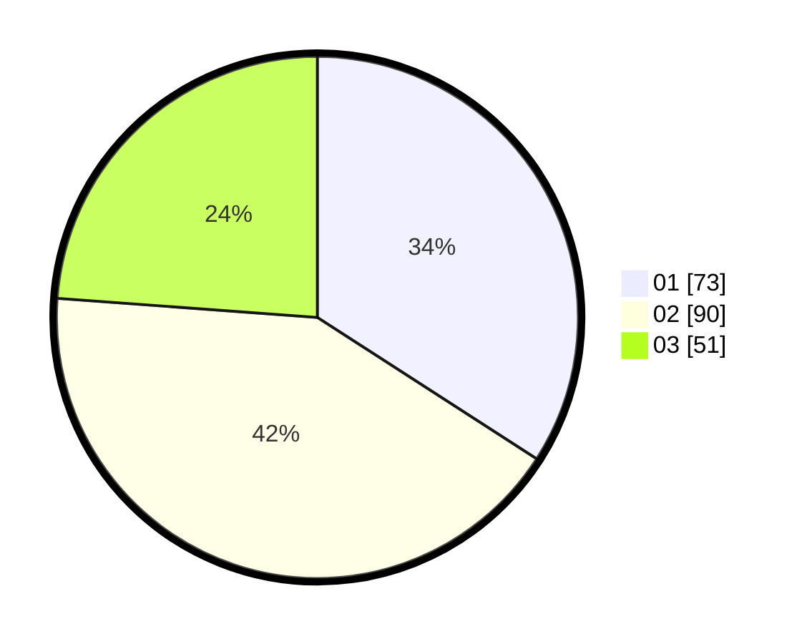

# Hasil

Hasil perolehan suara paslon dapat dilihat pada file paslon-01.txt, paslon-02.txt, dan paslon-03.txt.

Jika tidak ada, artinya data tersebut belum ada pada SIREKAP.

## Perolehan Suara

 * Paslon 01: **73**.
 * Paslon 02: **90**.
 * Paslon 03: **51**.

## Foto C Plano

https://sirekap-obj-formc.kpu.go.id/3cfe/pemilu/ppwp/31/73/02/10/02/3173021002060-20240214-162239--8d8ffe72-010e-4d22-9f57-cc999013b402.jpg

https://sirekap-obj-formc.kpu.go.id/3cfe/pemilu/ppwp/31/73/02/10/02/3173021002060-20240214-194806--cfc68efb-3f9e-46ea-b991-b9b18e383448.jpg

https://sirekap-obj-formc.kpu.go.id/3cfe/pemilu/ppwp/31/73/02/10/02/3173021002060-20240214-214912--dd0915aa-74f9-4126-af2e-e0c69f4e499c.jpg
