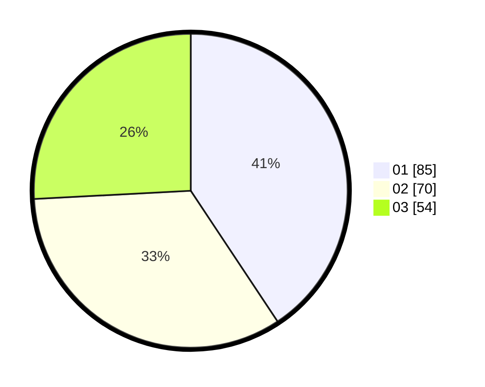

# Hasil

Hasil perolehan suara paslon dapat dilihat pada file paslon-01.txt, paslon-02.txt, dan paslon-03.txt.

Jika tidak ada, artinya data tersebut belum ada pada SIREKAP.

## Perolehan Suara

 * Paslon 01: **85**.
 * Paslon 02: **70**.
 * Paslon 03: **54**.

## Foto C Plano

https://sirekap-obj-formc.kpu.go.id/b5f4/pemilu/ppwp/31/73/02/10/03/3173021003003-20240216-021652--e552e1a9-ead9-403a-82fe-d8c50d3efaf8.jpg

https://sirekap-obj-formc.kpu.go.id/b5f4/pemilu/ppwp/31/73/02/10/03/3173021003003-20240216-015212--129ee61e-69e6-4bf9-8fc5-8ad3fd09d0ee.jpg

https://sirekap-obj-formc.kpu.go.id/b5f4/pemilu/ppwp/31/73/02/10/03/3173021003003-20240216-015209--c45cf0a0-fbb2-49fe-9e38-15e60c194628.jpg

## DATA PEMILIH TETAP

Jumlah pemilih dalam DPT: **278**.
 * L: **139**.
 * P: **139**.

## DATA PENGGUNA HAK PILIH

Jumlah pengguna hak pilih dalam DPT: **189**.
 * L: **98**.
 * P: **91**.

Jumlah pengguna hak pilih dalam DPTb: **18**.
 * L: **5**.
 * P: **13**.

Jumlah pengguna hak pilih dalam DPK: **4**.
 * L: **2**.
 * P: **2**.

Jumlah pengguna hak pilih: **211**.
 * L: **105**.
 * P: **106**.

## JUMLAH SUARA SAH DAN TIDAK SAH

JUMLAH SELURUH SUARA SAH: **209**.

JUMLAH SUARA TIDAK SAH: **2**.

JUMLAH SELURUH SUARA SAH DAN SUARA TIDAK SAH: **211**.
