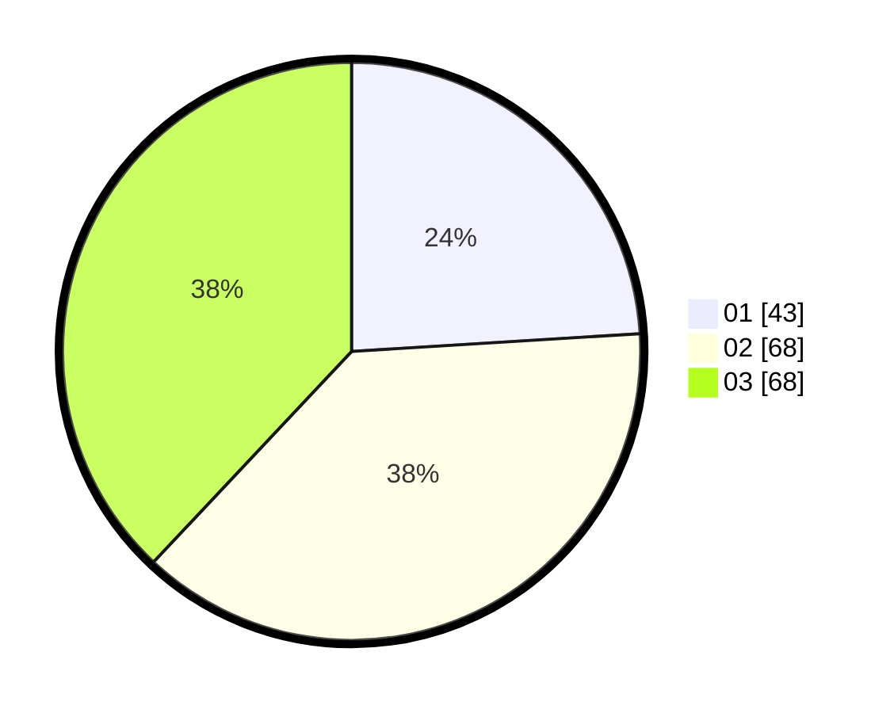

# Hasil

Hasil perolehan suara paslon dapat dilihat pada file paslon-01.txt, paslon-02.txt, dan paslon-03.txt.

Jika tidak ada, artinya data tersebut belum ada pada SIREKAP.

## Perolehan Suara

 * Paslon 01: **43**.
 * Paslon 02: **68**.
 * Paslon 03: **68**.

## Foto C Plano

https://sirekap-obj-formc.kpu.go.id/0476/pemilu/ppwp/31/73/02/10/03/3173021003004-20240216-144941--a7e21799-8eff-43be-93a2-8d0a3b6b85ee.jpg

https://sirekap-obj-formc.kpu.go.id/0476/pemilu/ppwp/31/73/02/10/03/3173021003004-20240216-144942--29ee4858-a643-463b-bbac-61d796ebc526.jpg

https://sirekap-obj-formc.kpu.go.id/0476/pemilu/ppwp/31/73/02/10/03/3173021003004-20240216-144941--c8777dd8-0f2e-435e-9d86-5f357b991d71.jpg

## DATA PEMILIH TETAP

Jumlah pemilih dalam DPT: **0**.
 * L: **0**.
 * P: **0**.

## DATA PENGGUNA HAK PILIH

Jumlah pengguna hak pilih dalam DPT: **0**.
 * L: **0**.
 * P: **0**.

Jumlah pengguna hak pilih dalam DPTb: **0**.
 * L: **0**.
 * P: **0**.

Jumlah pengguna hak pilih dalam DPK: **0**.
 * L: **0**.
 * P: **0**.

Jumlah pengguna hak pilih: **0**.
 * L: **0**.
 * P: **0**.

## JUMLAH SUARA SAH DAN TIDAK SAH

JUMLAH SELURUH SUARA SAH: **179**.

JUMLAH SUARA TIDAK SAH: **2**.

JUMLAH SELURUH SUARA SAH DAN SUARA TIDAK SAH: **181**.
