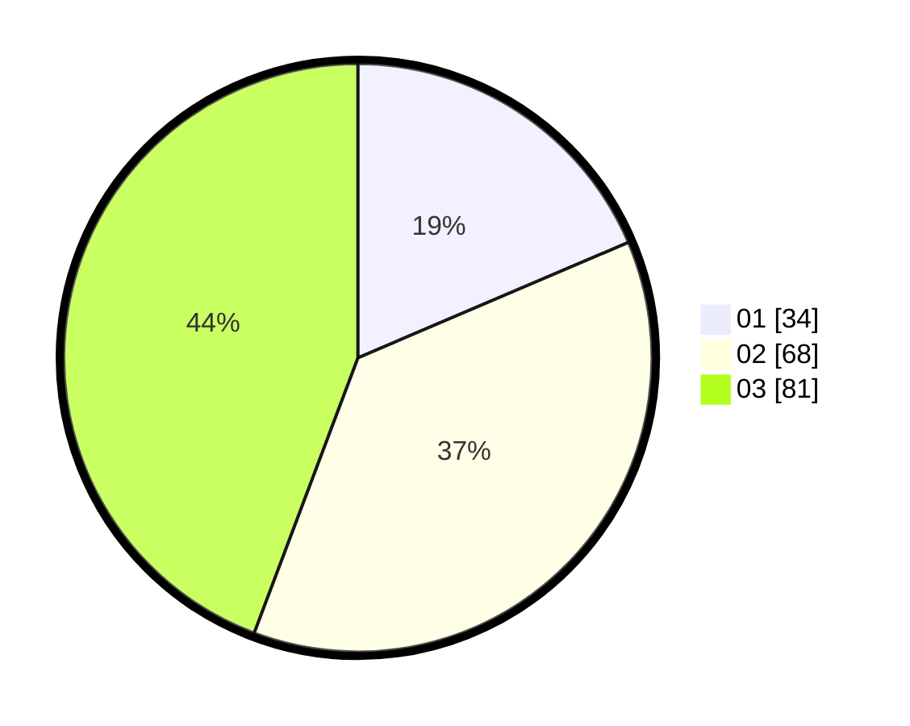

# Hasil

Hasil perolehan suara paslon dapat dilihat pada file paslon-01.txt, paslon-02.txt, dan paslon-03.txt.

Jika tidak ada, artinya data tersebut belum ada pada SIREKAP.

## Perolehan Suara

 * Paslon 01: **34**.
 * Paslon 02: **68**.
 * Paslon 03: **81**.

## Foto C Plano

https://sirekap-obj-formc.kpu.go.id/17e6/pemilu/ppwp/31/73/02/10/03/3173021003009-20240214-195124--6b080234-6715-4af2-849e-0acd6653d031.jpg

https://sirekap-obj-formc.kpu.go.id/17e6/pemilu/ppwp/31/73/02/10/03/3173021003009-20240214-195128--f096edf2-29c5-49f4-856b-db8aa1c9b8fc.jpg
