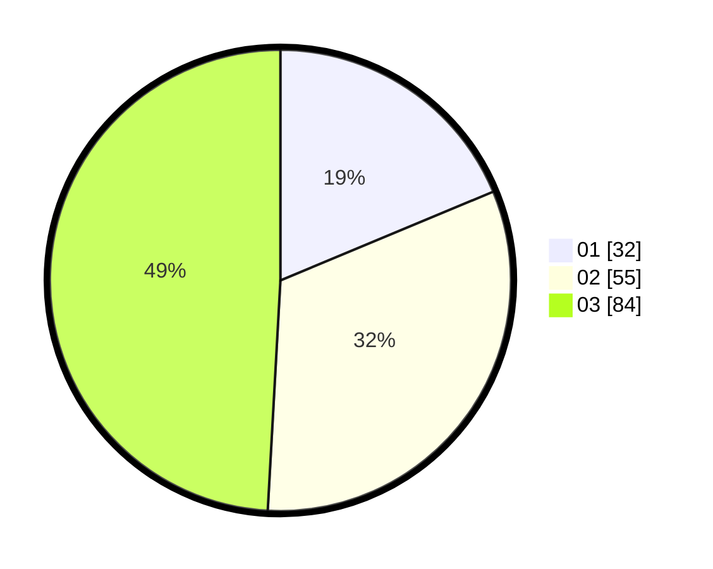

# Hasil

Hasil perolehan suara paslon dapat dilihat pada file paslon-01.txt, paslon-02.txt, dan paslon-03.txt.

Jika tidak ada, artinya data tersebut belum ada pada SIREKAP.

## Perolehan Suara

 * Paslon 01: **32**.
 * Paslon 02: **55**.
 * Paslon 03: **84**.

## Foto C Plano

https://sirekap-obj-formc.kpu.go.id/898d/pemilu/ppwp/31/73/02/10/03/3173021003010-20240216-030212--4b067705-ffc6-4856-903a-c9378784121c.jpg

https://sirekap-obj-formc.kpu.go.id/898d/pemilu/ppwp/31/73/02/10/03/3173021003010-20240216-031002--5146fb8d-a077-4c89-9d55-e773318afdd8.jpg

https://sirekap-obj-formc.kpu.go.id/898d/pemilu/ppwp/31/73/02/10/03/3173021003010-20240216-030219--d7200f04-3dc8-47bd-970b-17960234454d.jpg

## DATA PEMILIH TETAP

Jumlah pemilih dalam DPT: **202**.
 * L: **97**.
 * P: **105**.

## DATA PENGGUNA HAK PILIH

Jumlah pengguna hak pilih dalam DPT: **159**.
 * L: **73**.
 * P: **86**.

Jumlah pengguna hak pilih dalam DPTb: **12**.
 * L: **2**.
 * P: **10**.

Jumlah pengguna hak pilih dalam DPK: **0**.
 * L: **0**.
 * P: **0**.

Jumlah pengguna hak pilih: **171**.
 * L: **75**.
 * P: **96**.

## JUMLAH SUARA SAH DAN TIDAK SAH

JUMLAH SELURUH SUARA SAH: **171**.

JUMLAH SUARA TIDAK SAH: **1**.

JUMLAH SELURUH SUARA SAH DAN SUARA TIDAK SAH: **172**.
