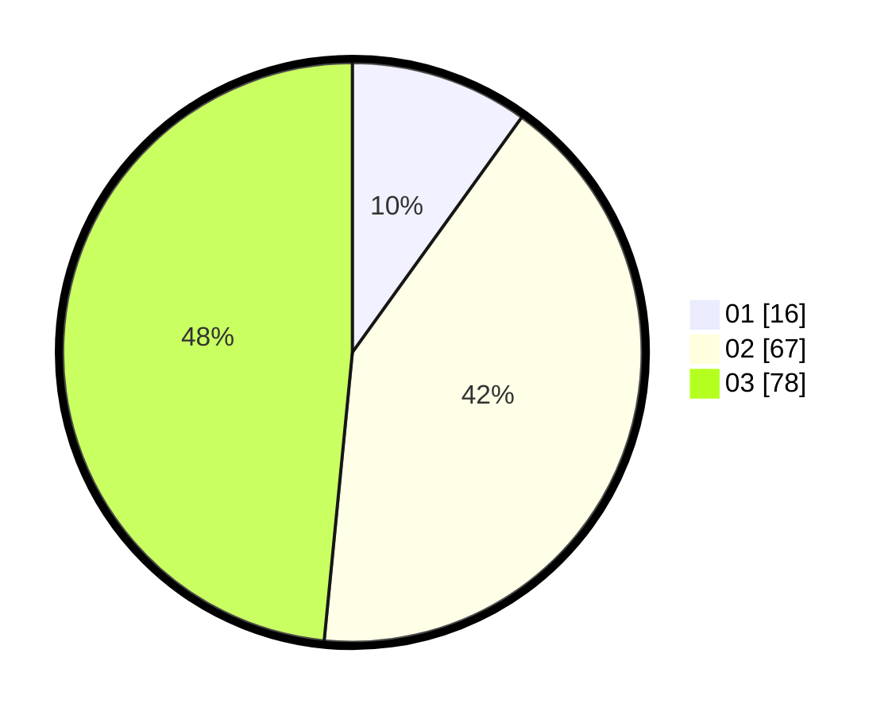

# Hasil

Hasil perolehan suara paslon dapat dilihat pada file paslon-01.txt, paslon-02.txt, dan paslon-03.txt.

Jika tidak ada, artinya data tersebut belum ada pada SIREKAP.

## Perolehan Suara

 * Paslon 01: **16**.
 * Paslon 02: **67**.
 * Paslon 03: **78**.

## Foto C Plano

https://sirekap-obj-formc.kpu.go.id/f01f/pemilu/ppwp/31/73/02/10/03/3173021003011-20240216-141648--b46a8e2b-4e52-45fb-ac4f-b68987a02499.jpg

https://sirekap-obj-formc.kpu.go.id/f01f/pemilu/ppwp/31/73/02/10/03/3173021003011-20240216-141649--d5d814b9-9152-44ba-be94-cdb168bde4e3.jpg

https://sirekap-obj-formc.kpu.go.id/f01f/pemilu/ppwp/31/73/02/10/03/3173021003011-20240216-141649--0258e8f7-3917-4be0-a46c-5b3656ed22c3.jpg

## DATA PEMILIH TETAP

Jumlah pemilih dalam DPT: **201**.
 * L: **95**.
 * P: **106**.

## DATA PENGGUNA HAK PILIH

Jumlah pengguna hak pilih dalam DPT: **150**.
 * L: **70**.
 * P: **80**.

Jumlah pengguna hak pilih dalam DPTb: **12**.
 * L: **5**.
 * P: **7**.

Jumlah pengguna hak pilih dalam DPK: **0**.
 * L: **0**.
 * P: **0**.

Jumlah pengguna hak pilih: **162**.
 * L: **75**.
 * P: **87**.

## JUMLAH SUARA SAH DAN TIDAK SAH

JUMLAH SELURUH SUARA SAH: **161**.

JUMLAH SUARA TIDAK SAH: **1**.

JUMLAH SELURUH SUARA SAH DAN SUARA TIDAK SAH: **162**.
