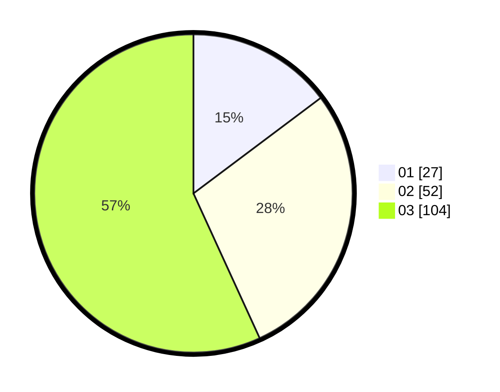

# Hasil

Hasil perolehan suara paslon dapat dilihat pada file paslon-01.txt, paslon-02.txt, dan paslon-03.txt.

Jika tidak ada, artinya data tersebut belum ada pada SIREKAP.

## Perolehan Suara

 * Paslon 01: **27**.
 * Paslon 02: **52**.
 * Paslon 03: **104**.

## Foto C Plano

https://sirekap-obj-formc.kpu.go.id/5261/pemilu/ppwp/31/73/02/10/03/3173021003013-20240216-000521--4dce71c1-da24-40c8-bb1b-60e66d21ca5a.jpg

https://sirekap-obj-formc.kpu.go.id/5261/pemilu/ppwp/31/73/02/10/03/3173021003013-20240216-000523--9a676568-eb23-402b-bf3e-e6386ab0d95f.jpg

https://sirekap-obj-formc.kpu.go.id/5261/pemilu/ppwp/31/73/02/10/03/3173021003013-20240216-000522--0623410d-0d21-41c4-8a82-1b712f74e8fa.jpg

## DATA PEMILIH TETAP

Jumlah pemilih dalam DPT: **0**.
 * L: **0**.
 * P: **0**.

## DATA PENGGUNA HAK PILIH

Jumlah pengguna hak pilih dalam DPT: **0**.
 * L: **0**.
 * P: **0**.

Jumlah pengguna hak pilih dalam DPTb: **0**.
 * L: **0**.
 * P: **0**.

Jumlah pengguna hak pilih dalam DPK: **0**.
 * L: **0**.
 * P: **0**.

Jumlah pengguna hak pilih: **0**.
 * L: **0**.
 * P: **0**.

## JUMLAH SUARA SAH DAN TIDAK SAH

JUMLAH SELURUH SUARA SAH: **183**.

JUMLAH SUARA TIDAK SAH: **1**.

JUMLAH SELURUH SUARA SAH DAN SUARA TIDAK SAH: **184**.
