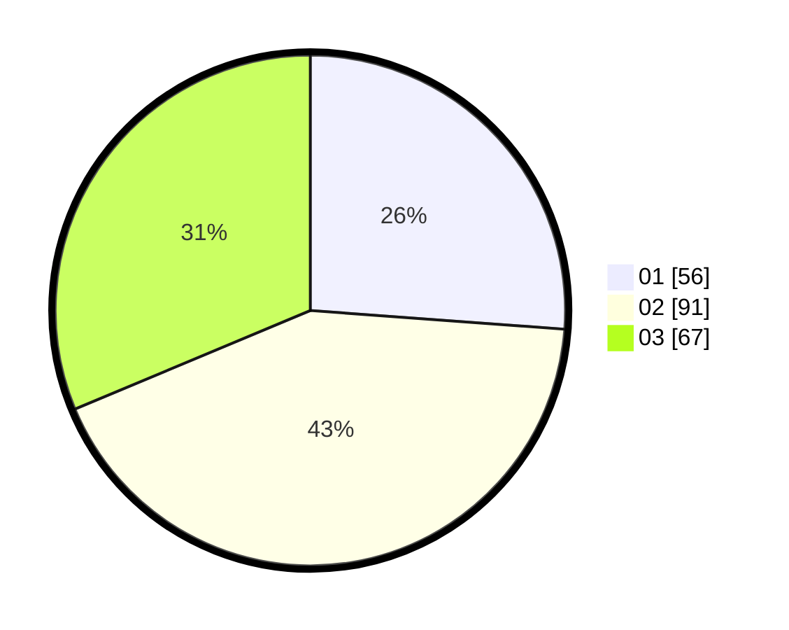

# Hasil

Hasil perolehan suara paslon dapat dilihat pada file paslon-01.txt, paslon-02.txt, dan paslon-03.txt.

Jika tidak ada, artinya data tersebut belum ada pada SIREKAP.

## Perolehan Suara

 * Paslon 01: **56**.
 * Paslon 02: **91**.
 * Paslon 03: **67**.

## Foto C Plano

https://sirekap-obj-formc.kpu.go.id/2857/pemilu/ppwp/31/73/02/10/03/3173021003018-20240217-202455--1688009a-447b-4bcb-a5f3-012407dae5f4.jpg

https://sirekap-obj-formc.kpu.go.id/2857/pemilu/ppwp/31/73/02/10/03/3173021003018-20240217-202456--e7eccb70-c61e-47b4-9657-3f741d6f0180.jpg

https://sirekap-obj-formc.kpu.go.id/2857/pemilu/ppwp/31/73/02/10/03/3173021003018-20240217-202455--530f738e-fe1c-4606-801f-b13501d04033.jpg

## DATA PEMILIH TETAP

Jumlah pemilih dalam DPT: **274**.
 * L: **121**.
 * P: **153**.

## DATA PENGGUNA HAK PILIH

Jumlah pengguna hak pilih dalam DPT: **214**.
 * L: **93**.
 * P: **121**.

Jumlah pengguna hak pilih dalam DPTb: **2**.
 * L: **2**.
 * P: **0**.

Jumlah pengguna hak pilih dalam DPK: **2**.
 * L: **2**.
 * P: **0**.

Jumlah pengguna hak pilih: **218**.
 * L: **97**.
 * P: **121**.

## JUMLAH SUARA SAH DAN TIDAK SAH

JUMLAH SELURUH SUARA SAH: **214**.

JUMLAH SUARA TIDAK SAH: **4**.

JUMLAH SELURUH SUARA SAH DAN SUARA TIDAK SAH: **218**.
