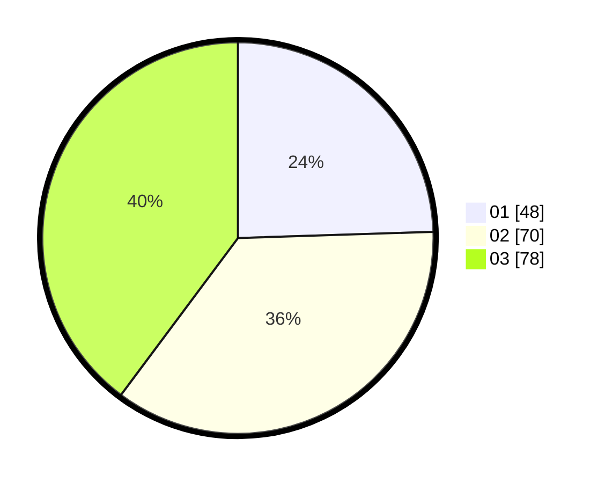

# Hasil

Hasil perolehan suara paslon dapat dilihat pada file paslon-01.txt, paslon-02.txt, dan paslon-03.txt.

Jika tidak ada, artinya data tersebut belum ada pada SIREKAP.

## Perolehan Suara

 * Paslon 01: **48**.
 * Paslon 02: **70**.
 * Paslon 03: **78**.

## Foto C Plano

https://sirekap-obj-formc.kpu.go.id/907d/pemilu/ppwp/31/73/02/10/03/3173021003020-20240216-142714--bbae406b-b514-4956-bb0e-07ef725b01d9.jpg

https://sirekap-obj-formc.kpu.go.id/907d/pemilu/ppwp/31/73/02/10/03/3173021003020-20240216-070454--a4373c03-fce3-40d1-a306-245986f920f3.jpg

https://sirekap-obj-formc.kpu.go.id/907d/pemilu/ppwp/31/73/02/10/03/3173021003020-20240216-070452--7e4e259a-db6a-48ab-a944-a0482062b237.jpg

## DATA PEMILIH TETAP

Jumlah pemilih dalam DPT: **289**.
 * L: **139**.
 * P: **150**.

## DATA PENGGUNA HAK PILIH

Jumlah pengguna hak pilih dalam DPT: **194**.
 * L: **93**.
 * P: **101**.

Jumlah pengguna hak pilih dalam DPTb: **3**.
 * L: **2**.
 * P: **1**.

Jumlah pengguna hak pilih dalam DPK: **4**.
 * L: **3**.
 * P: **1**.

Jumlah pengguna hak pilih: **201**.
 * L: **98**.
 * P: **103**.

## JUMLAH SUARA SAH DAN TIDAK SAH

JUMLAH SELURUH SUARA SAH: **196**.

JUMLAH SUARA TIDAK SAH: **5**.

JUMLAH SELURUH SUARA SAH DAN SUARA TIDAK SAH: **201**.
