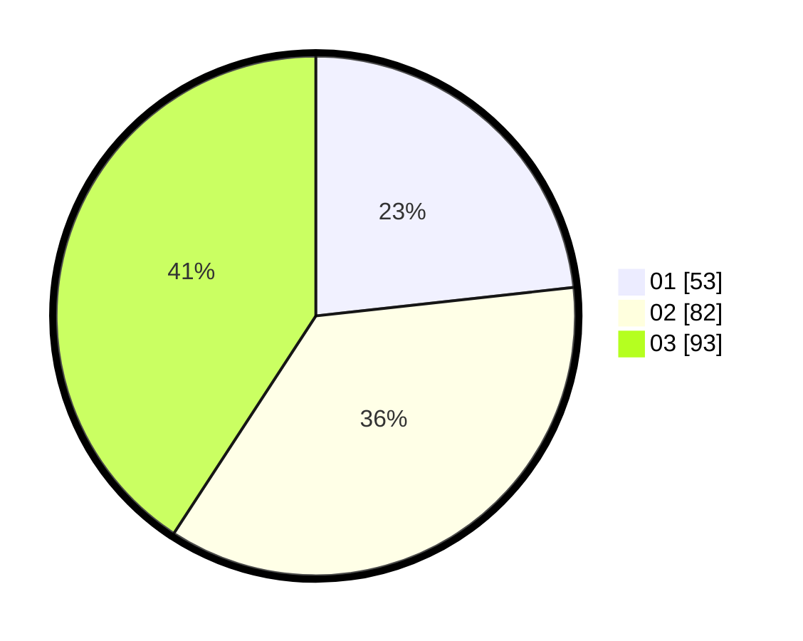

# Hasil

Hasil perolehan suara paslon dapat dilihat pada file paslon-01.txt, paslon-02.txt, dan paslon-03.txt.

Jika tidak ada, artinya data tersebut belum ada pada SIREKAP.

## Perolehan Suara

 * Paslon 01: **53**.
 * Paslon 02: **82**.
 * Paslon 03: **93**.

## Foto C Plano

https://sirekap-obj-formc.kpu.go.id/b3db/pemilu/ppwp/31/73/02/10/03/3173021003022-20240216-145833--f37c97d9-62e3-49bb-aa24-563b99decab5.jpg

https://sirekap-obj-formc.kpu.go.id/b3db/pemilu/ppwp/31/73/02/10/03/3173021003022-20240216-145835--1e5175f3-fb75-4a3e-b2d7-94faed3ff38e.jpg

https://sirekap-obj-formc.kpu.go.id/b3db/pemilu/ppwp/31/73/02/10/03/3173021003022-20240216-145834--66c22864-d934-41c5-99ed-c48e815411b9.jpg

## DATA PEMILIH TETAP

Jumlah pemilih dalam DPT: **0**.
 * L: **0**.
 * P: **0**.

## DATA PENGGUNA HAK PILIH

Jumlah pengguna hak pilih dalam DPT: **0**.
 * L: **0**.
 * P: **0**.

Jumlah pengguna hak pilih dalam DPTb: **0**.
 * L: **0**.
 * P: **0**.

Jumlah pengguna hak pilih dalam DPK: **0**.
 * L: **0**.
 * P: **0**.

Jumlah pengguna hak pilih: **0**.
 * L: **0**.
 * P: **0**.

## JUMLAH SUARA SAH DAN TIDAK SAH

JUMLAH SELURUH SUARA SAH: **228**.

JUMLAH SUARA TIDAK SAH: **1**.

JUMLAH SELURUH SUARA SAH DAN SUARA TIDAK SAH: **229**.
