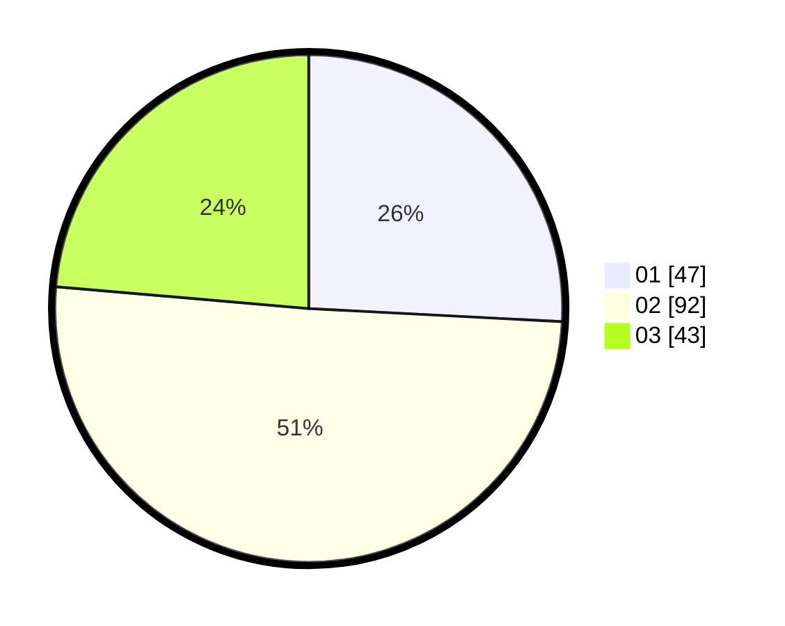

# Hasil

Hasil perolehan suara paslon dapat dilihat pada file paslon-01.txt, paslon-02.txt, dan paslon-03.txt.

Jika tidak ada, artinya data tersebut belum ada pada SIREKAP.

## Perolehan Suara

 * Paslon 01: **47**.
 * Paslon 02: **92**.
 * Paslon 03: **43**.

## Foto C Plano

https://sirekap-obj-formc.kpu.go.id/b9cf/pemilu/ppwp/31/73/02/10/03/3173021003032-20240216-111140--07c81024-c9d6-4600-b1ef-cd0009226e36.jpg

https://sirekap-obj-formc.kpu.go.id/b9cf/pemilu/ppwp/31/73/02/10/03/3173021003032-20240216-111142--271502aa-7618-424c-9087-f169ca1480bc.jpg

https://sirekap-obj-formc.kpu.go.id/b9cf/pemilu/ppwp/31/73/02/10/03/3173021003032-20240216-111141--207240d0-5e30-4434-b4d3-b790cfda28a5.jpg

## DATA PEMILIH TETAP

Jumlah pemilih dalam DPT: **234**.
 * L: **105**.
 * P: **129**.

## DATA PENGGUNA HAK PILIH

Jumlah pengguna hak pilih dalam DPT: **185**.
 * L: **86**.
 * P: **99**.

Jumlah pengguna hak pilih dalam DPTb: **0**.
 * L: **0**.
 * P: **0**.

Jumlah pengguna hak pilih dalam DPK: **0**.
 * L: **0**.
 * P: **0**.

Jumlah pengguna hak pilih: **185**.
 * L: **86**.
 * P: **99**.

## JUMLAH SUARA SAH DAN TIDAK SAH

JUMLAH SELURUH SUARA SAH: **182**.

JUMLAH SUARA TIDAK SAH: **3**.

JUMLAH SELURUH SUARA SAH DAN SUARA TIDAK SAH: **185**.
