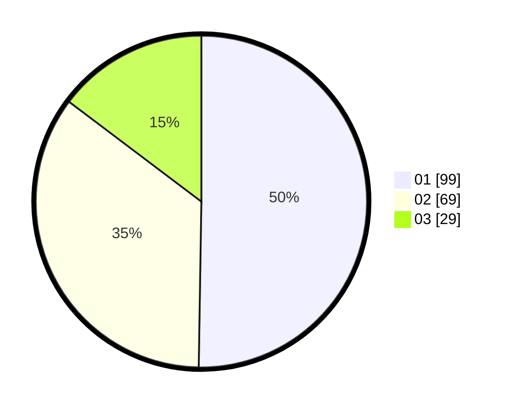

# Hasil

Hasil perolehan suara paslon dapat dilihat pada file paslon-01.txt, paslon-02.txt, dan paslon-03.txt.

Jika tidak ada, artinya data tersebut belum ada pada SIREKAP.

## Perolehan Suara

 * Paslon 01: **99**.
 * Paslon 02: **69**.
 * Paslon 03: **29**.

## Foto C Plano

https://sirekap-obj-formc.kpu.go.id/db5c/pemilu/ppwp/31/73/02/10/03/3173021003038-20240215-205622--8e60f364-5393-4c32-9600-11dfe9f503b6.jpg

https://sirekap-obj-formc.kpu.go.id/db5c/pemilu/ppwp/31/73/02/10/03/3173021003038-20240215-205624--f0e0f19c-3c80-4f7c-81b3-cf8c1362ecdd.jpg

https://sirekap-obj-formc.kpu.go.id/db5c/pemilu/ppwp/31/73/02/10/03/3173021003038-20240215-205623--3f3839c0-51b2-4df9-965d-3b278f1fe540.jpg

## DATA PEMILIH TETAP

Jumlah pemilih dalam DPT: **262**.
 * L: **135**.
 * P: **127**.

## DATA PENGGUNA HAK PILIH

Jumlah pengguna hak pilih dalam DPT: **197**.
 * L: **102**.
 * P: **95**.

Jumlah pengguna hak pilih dalam DPTb: **3**.
 * L: **1**.
 * P: **2**.

Jumlah pengguna hak pilih dalam DPK: **1**.
 * L: **1**.
 * P: **0**.

Jumlah pengguna hak pilih: **201**.
 * L: **104**.
 * P: **97**.

## JUMLAH SUARA SAH DAN TIDAK SAH

JUMLAH SELURUH SUARA SAH: **197**.

JUMLAH SUARA TIDAK SAH: **4**.

JUMLAH SELURUH SUARA SAH DAN SUARA TIDAK SAH: **201**.
