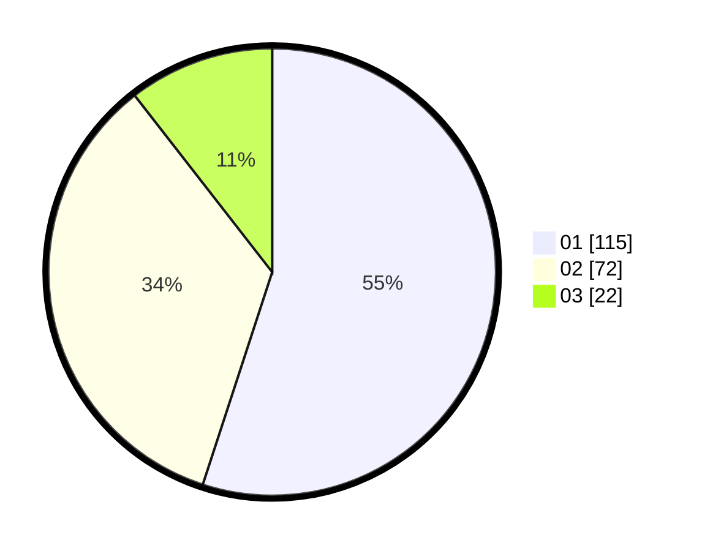

# Hasil

Hasil perolehan suara paslon dapat dilihat pada file paslon-01.txt, paslon-02.txt, dan paslon-03.txt.

Jika tidak ada, artinya data tersebut belum ada pada SIREKAP.

## Perolehan Suara

 * Paslon 01: **115**.
 * Paslon 02: **72**.
 * Paslon 03: **22**.

## Foto C Plano

https://sirekap-obj-formc.kpu.go.id/e4b9/pemilu/ppwp/31/73/02/10/03/3173021003040-20240215-010707--9e2d47c7-31ce-4edd-bbad-8b8ef58f1e72.jpg

https://sirekap-obj-formc.kpu.go.id/e4b9/pemilu/ppwp/31/73/02/10/03/3173021003040-20240215-010830--157b0d1c-1b13-4612-9265-1d6c6ec410b1.jpg

https://sirekap-obj-formc.kpu.go.id/e4b9/pemilu/ppwp/31/73/02/10/03/3173021003040-20240214-210748--2530e00b-8b78-452b-a8f0-f283ee636244.jpg
