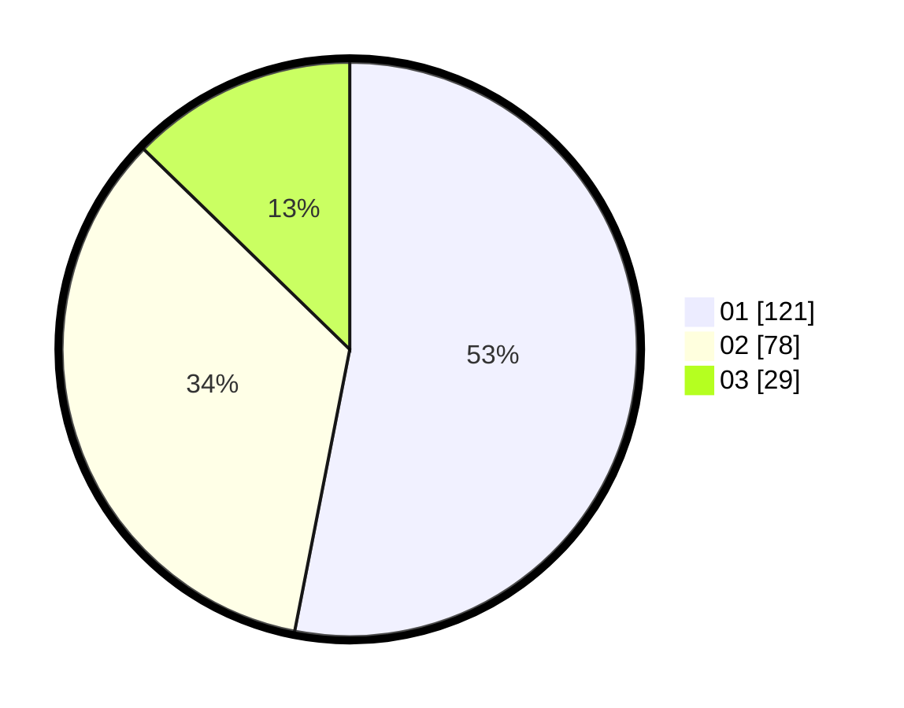

# Hasil

Hasil perolehan suara paslon dapat dilihat pada file paslon-01.txt, paslon-02.txt, dan paslon-03.txt.

Jika tidak ada, artinya data tersebut belum ada pada SIREKAP.

## Perolehan Suara

 * Paslon 01: **121**.
 * Paslon 02: **78**.
 * Paslon 03: **29**.

## Foto C Plano

https://sirekap-obj-formc.kpu.go.id/fe07/pemilu/ppwp/31/73/02/10/03/3173021003041-20240214-155138--930a231b-6adb-4262-ba15-d9fae2856b4f.jpg

https://sirekap-obj-formc.kpu.go.id/fe07/pemilu/ppwp/31/73/02/10/03/3173021003041-20240214-155615--9aa26f67-aa90-4920-87d5-08f17798c73f.jpg

https://sirekap-obj-formc.kpu.go.id/fe07/pemilu/ppwp/31/73/02/10/03/3173021003041-20240214-160105--936d45e3-c79f-4b17-9812-ed2c19c2f4a3.jpg

## DATA PEMILIH TETAP

Jumlah pemilih dalam DPT: **275**.
 * L: **136**.
 * P: **139**.

## DATA PENGGUNA HAK PILIH

Jumlah pengguna hak pilih dalam DPT: **221**.
 * L: **92**.
 * P: **129**.

Jumlah pengguna hak pilih dalam DPTb: **10**.
 * L: **9**.
 * P: **1**.

Jumlah pengguna hak pilih dalam DPK: **1**.
 * L: **0**.
 * P: **1**.

Jumlah pengguna hak pilih: **232**.
 * L: **101**.
 * P: **131**.

## JUMLAH SUARA SAH DAN TIDAK SAH

JUMLAH SELURUH SUARA SAH: **228**.

JUMLAH SUARA TIDAK SAH: **4**.

JUMLAH SELURUH SUARA SAH DAN SUARA TIDAK SAH: **232**.
