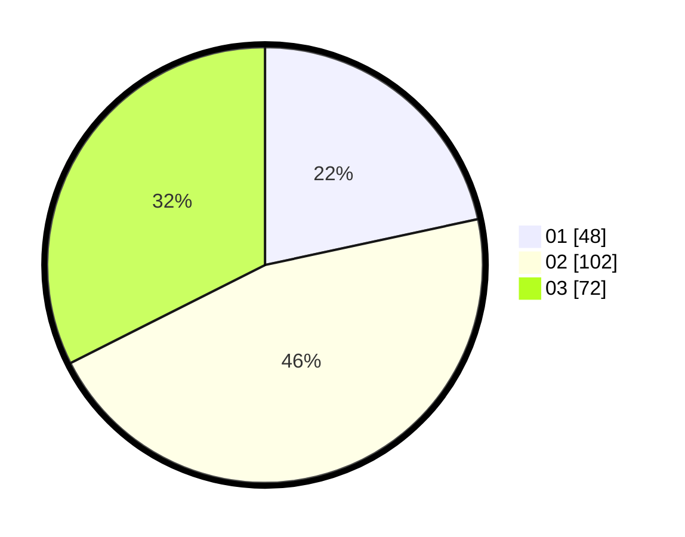

# Hasil

Hasil perolehan suara paslon dapat dilihat pada file paslon-01.txt, paslon-02.txt, dan paslon-03.txt.

Jika tidak ada, artinya data tersebut belum ada pada SIREKAP.

## Perolehan Suara

 * Paslon 01: **48**.
 * Paslon 02: **102**.
 * Paslon 03: **72**.

## Foto C Plano

https://sirekap-obj-formc.kpu.go.id/b3ea/pemilu/ppwp/31/73/02/10/03/3173021003042-20240216-142129--81471451-310b-4ec4-85d5-69fbbe8d7a7a.jpg

https://sirekap-obj-formc.kpu.go.id/b3ea/pemilu/ppwp/31/73/02/10/03/3173021003042-20240216-142130--b6e9e90e-0cb3-447e-b2f3-02329fd7939f.jpg

https://sirekap-obj-formc.kpu.go.id/b3ea/pemilu/ppwp/31/73/02/10/03/3173021003042-20240216-142130--a242ce49-ee1f-4a21-b2cf-99e871562751.jpg

## DATA PEMILIH TETAP

Jumlah pemilih dalam DPT: **275**.
 * L: **136**.
 * P: **139**.

## DATA PENGGUNA HAK PILIH

Jumlah pengguna hak pilih dalam DPT: **221**.
 * L: **104**.
 * P: **117**.

Jumlah pengguna hak pilih dalam DPTb: **5**.
 * L: **3**.
 * P: **2**.

Jumlah pengguna hak pilih dalam DPK: **0**.
 * L: **0**.
 * P: **0**.

Jumlah pengguna hak pilih: **226**.
 * L: **107**.
 * P: **119**.

## JUMLAH SUARA SAH DAN TIDAK SAH

JUMLAH SELURUH SUARA SAH: **222**.

JUMLAH SUARA TIDAK SAH: **4**.

JUMLAH SELURUH SUARA SAH DAN SUARA TIDAK SAH: **226**.
