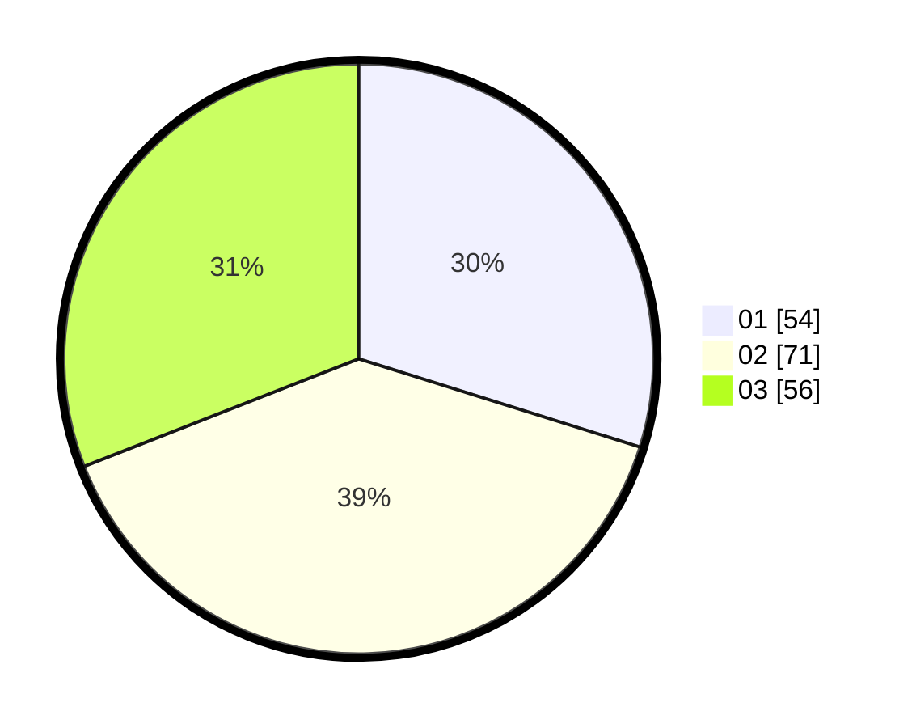

# Hasil

Hasil perolehan suara paslon dapat dilihat pada file paslon-01.txt, paslon-02.txt, dan paslon-03.txt.

Jika tidak ada, artinya data tersebut belum ada pada SIREKAP.

## Perolehan Suara

 * Paslon 01: **54**.
 * Paslon 02: **71**.
 * Paslon 03: **56**.

## Foto C Plano

https://sirekap-obj-formc.kpu.go.id/35d6/pemilu/ppwp/31/73/02/10/03/3173021003044-20240216-150348--6805edc2-64ff-4633-ad2d-c1da5081acf1.jpg

https://sirekap-obj-formc.kpu.go.id/35d6/pemilu/ppwp/31/73/02/10/03/3173021003044-20240216-150349--12eae802-ec69-40b9-ae88-908f27441b37.jpg

https://sirekap-obj-formc.kpu.go.id/35d6/pemilu/ppwp/31/73/02/10/03/3173021003044-20240216-150348--c27d722f-34d5-4397-9926-07ef39b35b11.jpg

## DATA PEMILIH TETAP

Jumlah pemilih dalam DPT: **170**.
 * L: **85**.
 * P: **85**.

## DATA PENGGUNA HAK PILIH

Jumlah pengguna hak pilih dalam DPT: **170**.
 * L: **85**.
 * P: **85**.

Jumlah pengguna hak pilih dalam DPTb: **9**.
 * L: **5**.
 * P: **4**.

Jumlah pengguna hak pilih dalam DPK: **3**.
 * L: **1**.
 * P: **2**.

Jumlah pengguna hak pilih: **182**.
 * L: **91**.
 * P: **91**.

## JUMLAH SUARA SAH DAN TIDAK SAH

JUMLAH SELURUH SUARA SAH: **182**.

JUMLAH SUARA TIDAK SAH: **1**.

JUMLAH SELURUH SUARA SAH DAN SUARA TIDAK SAH: **183**.
