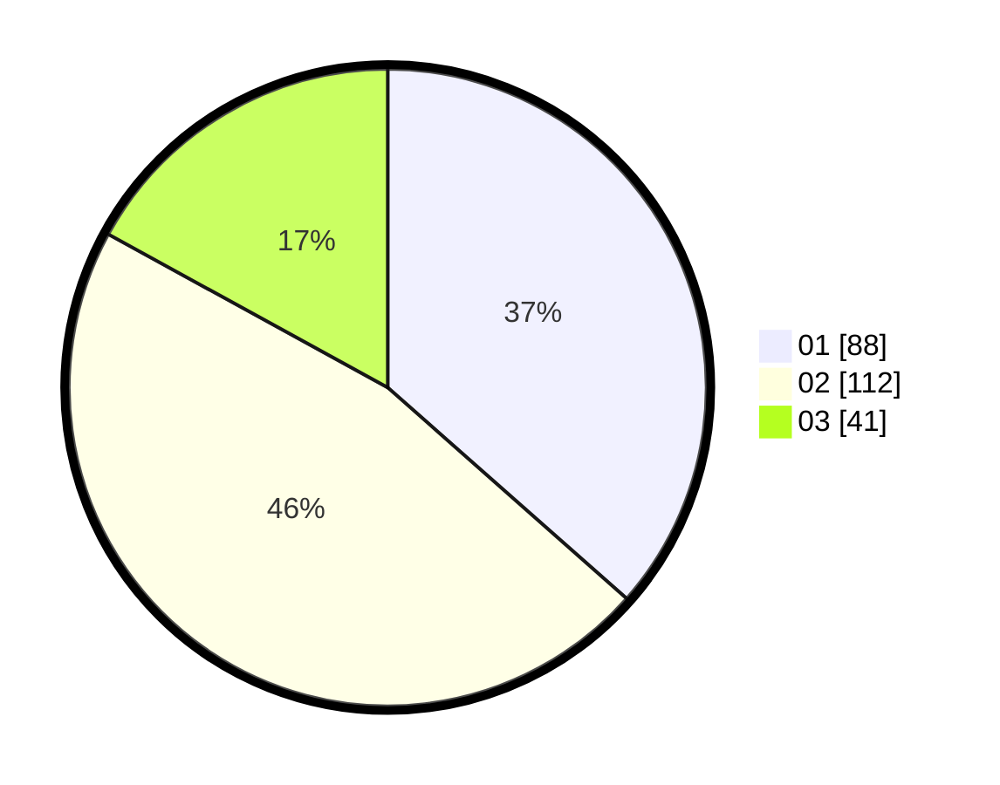

# Hasil

Hasil perolehan suara paslon dapat dilihat pada file paslon-01.txt, paslon-02.txt, dan paslon-03.txt.

Jika tidak ada, artinya data tersebut belum ada pada SIREKAP.

## Perolehan Suara

 * Paslon 01: **88**.
 * Paslon 02: **112**.
 * Paslon 03: **41**.

## Foto C Plano

https://sirekap-obj-formc.kpu.go.id/832b/pemilu/ppwp/31/73/02/10/03/3173021003046-20240216-094604--90051f86-a092-41ee-b520-fad1585bc0b0.jpg

https://sirekap-obj-formc.kpu.go.id/832b/pemilu/ppwp/31/73/02/10/03/3173021003046-20240216-094605--a9d43c76-ca8d-4de2-b07f-24ec1982eede.jpg

https://sirekap-obj-formc.kpu.go.id/832b/pemilu/ppwp/31/73/02/10/03/3173021003046-20240216-065311--2d07bee1-7edc-45cb-a78c-0be6af7fb6b5.jpg

## DATA PEMILIH TETAP

Jumlah pemilih dalam DPT: **282**.
 * L: **142**.
 * P: **140**.

## DATA PENGGUNA HAK PILIH

Jumlah pengguna hak pilih dalam DPT: **234**.
 * L: **111**.
 * P: **123**.

Jumlah pengguna hak pilih dalam DPTb: **7**.
 * L: **0**.
 * P: **7**.

Jumlah pengguna hak pilih dalam DPK: **6**.
 * L: **1**.
 * P: **5**.

Jumlah pengguna hak pilih: **247**.
 * L: **112**.
 * P: **135**.

## JUMLAH SUARA SAH DAN TIDAK SAH

JUMLAH SELURUH SUARA SAH: **241**.

JUMLAH SUARA TIDAK SAH: **6**.

JUMLAH SELURUH SUARA SAH DAN SUARA TIDAK SAH: **247**.
